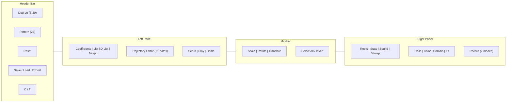

# PolyPaint v32

**[Try it live](https://nassuphis.github.io/karpo_hackathon/)**

Interactive polynomial root visualizer. Drag coefficients or roots in the complex plane and watch everything update in real time.

## What It Does

A degree-*n* polynomial p(z) = c_n z^n + c_(n-1) z^(n-1) + ... + c_0 has *n*+1 complex coefficients and *n* complex roots. The relationship between them is rich, nonlinear, and often surprising -- small changes to one coefficient can send roots flying across the plane, while other perturbations barely move them.

PolyPaint makes this relationship tangible. Two side-by-side complex-plane panels let you explore it from both directions: drag coefficients on the left and watch roots respond on the right, or drag roots and watch the coefficients reconstruct themselves.

<video controls loop muted playsinline width="720" src="https://github.com/user-attachments/assets/7ab7733b-4a6f-47b2-b8fe-a9f650cd9c22"></video>

Everything runs client-side in a single HTML file. No server, no build step, no dependencies to install.

## Features

### Explore

- **Dual complex-plane panels** -- coefficients (left) and roots (right) with real-time bidirectional coupling
- **Multi-select and marquee** -- click dots to toggle, drag empty canvas to lasso, group-move selections
- **Transform tools** -- scale, rotate, and translate with live preview ([Interface Guide](docs/interface.md#mid-bar-operations))
- **26 initial patterns** in 3 categories: basic, coefficient shapes, root shapes ([Patterns](docs/patterns.md))
- **Add/delete coefficients** -- right-click canvas to add, right-click a dot to edit or delete

### Animate

- **Per-coefficient trajectories** -- 21 path types including circle, spiral, figure-8, Hilbert, and Sierpinski ([Paths](docs/paths.md))
- **Independent settings** -- each coefficient has its own path type, radius, speed, angle, and direction
- **Morph blending** -- a second coefficient set (D-nodes) animates alongside the primary set with independent paths ([Morph](docs/morph.md), [D-Node Paths](docs/d-node-paths.md))

### Visualize

- **Domain coloring** -- HSL-mapped complex landscape on the roots panel background
- **Sensitivity coloring** -- Jacobian-based derivative mode colors each root blue (stable) through white to red (volatile)
- **Root trails** -- colored SVG paths with loop detection and auto-stop; jump detection breaks trails at root-identity swaps

### Compute

- **Bitmap rendering** -- accumulate root positions as pixels at up to 25,000 x 25,000 resolution with off-canvas compute/display split ([Off-Canvas](docs/off-canvas-render.md))
- **Fast mode** -- parallel Web Workers distribute the solver across 1-16 threads for continuous off-main-thread computation ([Workers](docs/worker_implementation.md))
- **WASM solver** -- Ehrlich-Aberth algorithm compiled from C, base64-embedded, ~2KB ([WASM](docs/wasm_investigation.md))
- **10 jiggle modes** -- explore nearby parameter space between cycles: random, rotate, walk, scale, circle, spiral, breathe, wobble, lissajous ([Paths](docs/paths.md#jiggle--path-perturbation-between-cycles))
- **Multi-format export** -- JPEG, PNG, BMP, TIFF images + WebM video recording in 7 capture modes

### Analyze

- **Stats dashboard** -- 4x4 grid of 16 configurable plots, selectable from 23 time-series, 5 phase-space, and 4 spectrum chart types
- **Sonification features** in stats -- 6 audio-pipeline metrics (MedianR, Spread, EMed, EHi, Coherence, Encounters) with EMA smoothing

### Listen

- **Three instruments** -- FM drone (Base), pentatonic arpeggiator (Melody), encounter beeps (Voice) ([Sonification](docs/sonification.md))
- **Signal routing matrix** -- patch any of 25 computed stats into any of 14 audio parameters with per-route normalization and smoothing

## Quick Start

1. Open [`index.html`](index.html) in any modern browser, or visit the **[live demo](https://nassuphis.github.io/karpo_hackathon/)**
2. **Drag a coefficient** on the left panel and watch the roots move on the right
3. Select several coefficients, choose **Circle** from the path dropdown, and press **Play**
4. Click **Trails** on the roots toolbar to see root braid patterns emerge
5. Open the **Bitmap** tab, click **init**, set resolution to 2000, and click **start** to accumulate a high-resolution render
6. Switch to the **Stats** tab to see 16 live plots of root dynamics
7. Click **B** in the Sound tab to enable the FM drone and hear the roots

See the [Interface Guide](docs/interface.md) for the complete control reference.

## Interface Overview



| Area | Key Controls |
|------|-------------|
| **Header** | Degree slider (3-30), Pattern dropdown (26 options), Reset, Save/Load, Export (7 modes), C (workers), T (timing) |
| **Left tabs** | Coefficients (SVG + drag), List (table + 21 transforms), D-List (morph targets), Morph (blend control) |
| **Trajectory editor** | Path type (21 curves in 3 groups), per-path sliders (R/S/A/CW), PS (prime speed), Update Sel |
| **Mid-bar** | Scale (0.1x-10x), Rotate (0.5 turns), Translate (2D pad), Select all/none, Invert |
| **Roots toolbar** | Trails toggle, color mode (Uniform / Index Rainbow / Derivative), domain coloring, Fit, +25% |
| **Right tabs** | Roots (visualization), Stats (16 plots, 32 chart types), Sound (3 voices + routing matrix), Bitmap (fast mode + export) |
| **Bitmap** | init/save/clear, resolution (1K-25K), start/stop, steps (10-1M), cfg (solver, jiggle, 4 color modes, 3 match strategies) |
| **Recording** | WebM capture: Roots, Coeffs, Both, Stats, Sound, Bitmap, or Full. Auto-stop on loop completion. |

For the full control reference with detailed tables, see the [Interface Guide](docs/interface.md).

## Architecture

```
Single HTML file (~12,200 lines)
  CSS (inline)            Layout, popover positioning, animation styles
  HTML                    Header, panels, SVG containers, popovers
  JavaScript (inline)     All application logic:
    Ehrlich-Aberth solver   Root finding with cubic convergence
    Horner evaluator        Domain coloring + derivative computation
    Canvas 2D API           Domain coloring, bitmap rendering
    Web Workers             Parallel fast-mode computation
    Web Audio API           Sonification pipeline
  CDN dependencies
    d3.js v7                SVG rendering, scales, drag interactions
    html2canvas             Full-page snapshot export
  Embedded WASM           Base64-encoded Ehrlich-Aberth solver (~2KB)
```

No server, no WebSocket, no build tools. See [Solver](docs/solver.md) for the root-finding algorithm and [Workers](docs/worker_implementation.md) for the multi-worker architecture.

## Documentation

### Core Algorithms

- [Ehrlich-Aberth Solver](docs/solver.md) -- root finding, warm-starting, domain coloring
- [WASM Solver](docs/wasm_investigation.md) -- C-to-WASM compilation, memory layout, benchmarks

### Animation & Paths

- [Paths & Curves](docs/paths.md) -- 21 path types, curve representation, cycle sync, jiggle modes, space-filling curves
- [Morph Blending](docs/morph.md) -- dual coefficient sets, mu oscillation
- [D-Node Paths](docs/d-node-paths.md) -- morph target animation, fast mode integration
- [Root Braids](docs/braids.md) -- monodromy, braid topology, trail visualization

### Rendering & Performance

- [Fast Mode Workers](docs/worker_implementation.md) -- multi-worker architecture, sparse pixel format, lifecycle
- [Off-Canvas Rendering](docs/off-canvas-render.md) -- compute/display split, GPU memory management at 10K-25K
- [Performance Analysis](docs/memory_timings.md) -- persistent buffer optimization, timing data

### User Interface

- [Tutorial](docs/tutorial.md) -- step-by-step guide to capturing root trajectory PNGs, with screenshots
- [Interface Guide](docs/interface.md) -- complete control reference with tables for all controls, paths, stats, color modes, and jiggle modes
- [Patterns & Gallery](docs/patterns.md) -- 26 initial patterns, annotated trail screenshots
- [Sonification](docs/sonification.md) -- audio graph, feature extraction, sound mapping, signal routing

### Developer Notes

- [Architecture Notes](docs/architecture.md) -- section map, code conventions, key locations, debugging insights
- [Testing](docs/test-results.md) -- 425 Playwright tests across 20 files, JS/WASM benchmarks

## File Structure

```
karpo_hackathon/
  index.html          Entire app: CSS + HTML + JS + WASM (~12,200 lines)
  solver.c            WASM solver source (Ehrlich-Aberth in C)
  solver.wasm         Compiled WASM binary (~2KB)
  build-wasm.sh       Compile solver.c -> base64-embedded WASM
  docs/               Technical documentation (14 files)
  tests/              Playwright tests (430 tests, 20 files)
  snaps/              Saved snapshots (PNG + JSON)
```

## Running Tests

```bash
python -m pytest tests/ -v
```

See [test-results.md](docs/test-results.md) for the full test catalog and benchmark results.
