# Interface Guide

Complete control reference for PolyPaint v38. For a quick overview, see the [README](../README.md#interface-overview).

## Layout Overview


The UI is organized around a compact header bar and two side-by-side complex-plane panels (left: coefficients, right: roots) with an operations mid-bar between them.

---

## Header Bar


| Control | ID | Description |
|---------|----|-------------|
| **PolyPaint v38** | `.app-title` | App title and version label. |
| **Degree** | `#degree-number` | Click the number to open a slider popover (2-30). Reinitializes coefficients on change. |
| **Pattern** | `#pattern` | Initial arrangement of coefficients or roots. 26 patterns in 3 categories: Basic (5), Coefficient shapes (8), Root shapes (13). See [Patterns](patterns.md). |
| **Reset** | `#reset-btn` | Reset to initial state for the current degree and pattern. |
| **Save** | `#save-btn` | Save full application state as a JSON file. |
| **Load** | `#load-btn` | Load a previously saved JSON snapshot. |
| **Export** | `#snap-btn` | Opens a popup with 7 export modes (see below). |
| **T** | `#timing-btn` | Timing stats popup: steps/sec, pass times, composite breakdown. Clears when worker count changes. |
| **Scrub slider** | `#scrub-slider` | Additive scrubber (range 0-5000): drag to add seconds to the current elapsed time. Only works when animation is paused. Resets to zero on release. |
| **Play / Pause / Resume** | `#play-btn` | 3-state cycle: **Play** starts from zero, **Pause** stops mid-animation, **Resume** continues from where it left off. Requires at least one animated C-node, D-node, or morph enabled. |
| **Seconds counter** | `#anim-seconds` | Displays current animation elapsed time (e.g. `3.14s`). Updates during playback and scrubbing. |
| **Home** | `#home-btn` | Return all animated C and D nodes to their start positions (curve[0]) and reset elapsed to 0. |

### Header Layout Order

Left to right: App title | Degree + Pattern | Reset | Save + Load + Export | T | Scrub slider | Play/Pause/Resume | Seconds counter | Home

### Export Popup


Seven capture modes: Both, Coeffs, Roots, Stats, Sound, Bitmap, Full. Each downloads a PNG screenshot plus a JSON snapshot of the full app state.

---

## Left Panel

The left panel has six tabs: C-Nodes, C-List, D-Nodes, D-List, Jiggle, and Final.

### C-Nodes Tab

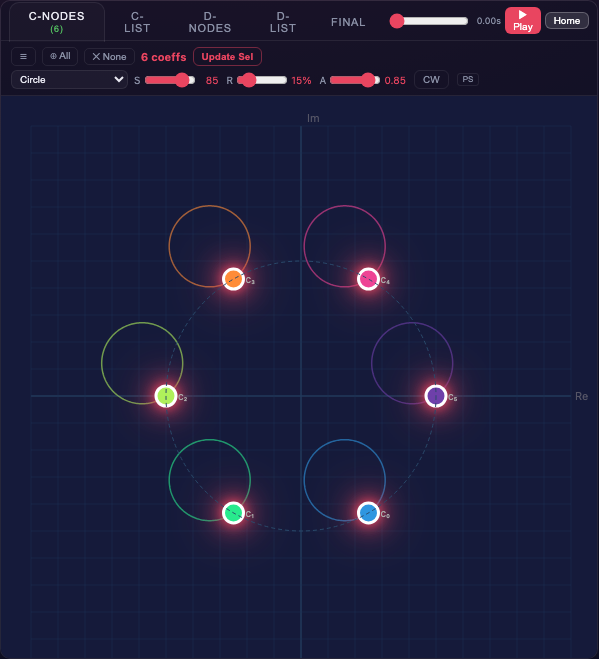

Interactive SVG complex-plane visualization of polynomial coefficients (`#coeff-panel` inside `#coeff-container`).

- **Drag** any coefficient dot to move it; roots update instantly on the right panel.
- **Right-click empty canvas** to add a new coefficient at that position (becomes the new highest-power term).
- **Right-click an existing coefficient** to open a context menu (`#coeff-ctx`) with trajectory settings, live preview, and a Delete button (disabled when only 3 coefficients remain, since minimum degree is 2). Click "Accept" to commit or press Escape to revert. A reposition button cycles the menu through 4 quadrants.
- Assigned trajectory curves are always visible as colored paths on the canvas.

### Trajectory Editor (Animation Bar)


Located at the top of the C-Nodes tab (`#anim-bar`). Controls the animation path for selected coefficients.

**First row:** Coefficient picker (`#coeff-picker-btn`), Select All (`#select-all-coeffs-btn`) / Deselect (`#deselect-all-btn`), selection label (`#bar-title`), **Update Whole Selection** button (`#sel2path-btn`).

**Second row (`#bar-controls`):** Path type dropdown (`#anim-path`) and path-specific controls (`#bar-dynamic`). Sliders change based on the chosen path type (e.g. R/S/A/CW-CCW for circles, S/sigma for Gaussian). Adjusting controls shows a live preview of the proposed paths. Click away or press Escape to revert; click **Update Whole Selection** to commit. Controls dim when no coefficients are selected.

#### Preview / Revert / Commit Pattern

The trajectory editor uses a preview/revert workflow. When you change the path dropdown or adjust a slider, the changes are shown as a live preview on the canvas (backed by `barSnapshots` which stores the original state). You can:

- Click **Update Whole Selection** to commit the previewed changes (`commitBarPreview()`)
- Click outside the editor or press **Escape** to revert to the original state (`revertBarPreview()`)

This replaces the previous immediate-apply behavior, giving you a chance to experiment without permanently changing paths.

#### Path Types (40 for C-nodes, 41 for D-nodes)

Paths are defined in `PATH_CATALOG`. Every path in a group (except Gaussian cloud) automatically gets a dithered variant that adds small Gaussian noise to each step.

| Group | Base Paths | With Dither |
|-------|-----------|-------------|
| **Top-level** | None | -- |
| **D-only** | Follow C | -- |
| **Basic** | Circle, Horizontal, Vertical, Spiral, Gaussian cloud | +4 dithered (cloud excluded) |
| **Curves** | Lissajous, Figure-8, Cardioid, Astroid, Deltoid, Rose (3-petal), Spirograph, Hypotrochoid, Butterfly, Star (pentagram), Square, C-Ellipse | +12 dithered |
| **Space-filling** | Hilbert (Moore), Peano, Sierpinski | +3 dithered |

Each coefficient stores its own path type, radius, speed, angle, and direction independently. See [Paths](paths.md) for curve formulas, cycle sync, and space-filling curve details.

#### Trajectory Workflow

1. Select one or more coefficients (click, marquee, or Select All)
2. Choose a path type and adjust controls -- a live preview shows the proposed paths
3. Click **Update Whole Selection** to commit, or click away / press Escape to revert
4. Press **Play** (in the header bar) -- all coefficients with a trajectory animate simultaneously

### C-List Tab

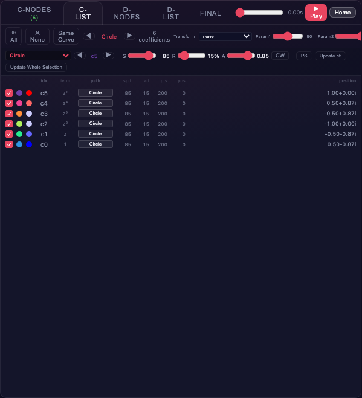

Tabular view of all coefficients with per-row columns:

| Column | Content |
|--------|---------|
| Checkbox | Selection toggle |
| Color dot | Index-based color |
| Sensitivity dot | Jacobian sensitivity indicator |
| Label | Coefficient index (c0, c1, ...) |
| Power | Polynomial power |
| Path | Animation path type (clickable to open per-coefficient path picker popup) |
| Speed | Animation speed (or dash) |
| Radius | Path radius (or dash) |
| Curve length | Number of sample points |
| Curve index | Current position along path |
| Coordinates | Complex value (re + im*i) |

**Toolbar (`#coeff-list-toolbar`):** Select All (`#list-select-all-btn`) / Deselect (`#list-deselect-all-btn`), **Same Curve** (`#list-all-curves-btn`) selects all coefficients with the displayed curve type, curve type cycler (prev `#list-curve-prev` / next `#list-curve-next` arrows to cycle through path types present in the polynomial, display label `#list-curve-cycle`), selection count (`#list-count`), Transform dropdown (`#list-transform`), Param1 (`#list-sel-speed`) / Param2 (`#list-sel-param2`) sliders.

#### C-List Curve Editor

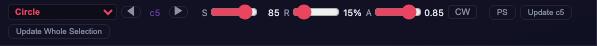

The curve editor (`#list-curve-editor`) below the toolbar lets you edit the path for the selection. It shows a path type dropdown (`#lce-path-sel`) and path-specific controls (`#lce-controls`) based on the first selected coefficient's current path type (tracked by `lceRefIdx`). Choose a path type, adjust parameters, and click **Update Whole Selection** (`#lce-update-sel`) to apply to all selected coefficients. Controls dim when nothing is selected.

#### Transform dropdown (20 bulk operations)

| Transform | Description |
|-----------|-------------|
| PrimeSpeeds | Set all speeds coprime with each other |
| Set All Speeds | Set selected to Param1 speed |
| RandomSpeed | Random speed for each selected |
| RandomAngle | Random starting angle |
| RandomRadius | Random radius |
| Lerp Speed | Interpolate speeds from Param1 to Param2 |
| Lerp Radius | Interpolate radii |
| Lerp Angle | Interpolate angles |
| RandomDirection | Random CW/CCW for each |
| FlipAllDirections | Toggle CW/CCW on all selected |
| ShuffleCurves | Randomly reassign path shapes |
| ShufflePositions | Randomly swap home positions |
| CircleLayout | Arrange selected on a circle |
| RotatePositions | Rotate home positions by Param1 degrees |
| ScalePositions | Scale home positions by Param1 factor |
| JitterPositions | Add Gaussian noise to positions |
| Conjugate | Reflect across real axis |
| InvertPositions | Invert through unit circle |
| SortByModulus | Reorder by distance from origin |
| SortByArgument | Reorder by angle from positive real axis |

**Param1 / Param2** sliders (range 1-1000) supply arguments to transforms that need them (e.g. Lerp endpoints, rotation angle). Speed values use thousandths (e.g. Param1=500 means speed 0.500).

### D-Nodes Tab

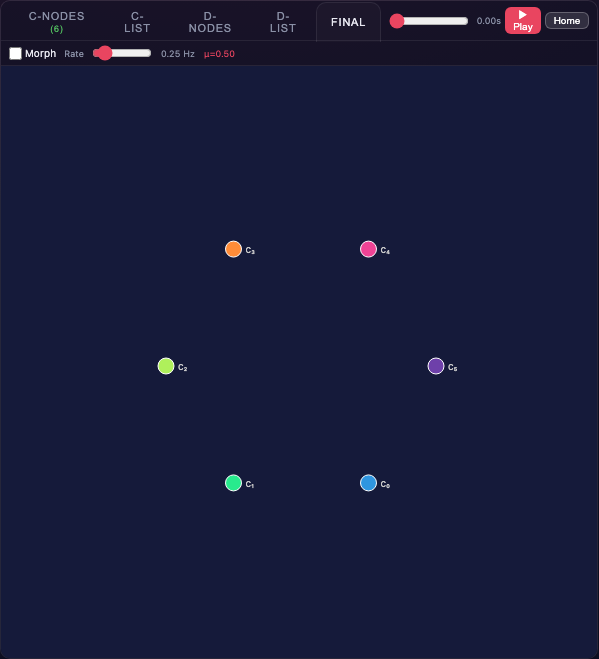

Interactive SVG complex-plane visualization of morph target D-nodes (`#morph-panel` inside `#morph-container`). See [Morph](morph.md).

- **Copy C->D** (`#morph-copy-btn`) / **Swap C<->D** (`#morph-swap-btn`) buttons in the toolbar (`#morph-bar`)
- D-node dots with drag interaction (same as coefficient panel)
- **Right-click a D-node** to open a context menu (`#dnode-ctx`) with the same trajectory settings, live preview, Accept/Delete/reposition as the C-node context menu
- Selection count shown in the tab header (`#morph-sel-count`)

### D-List Tab

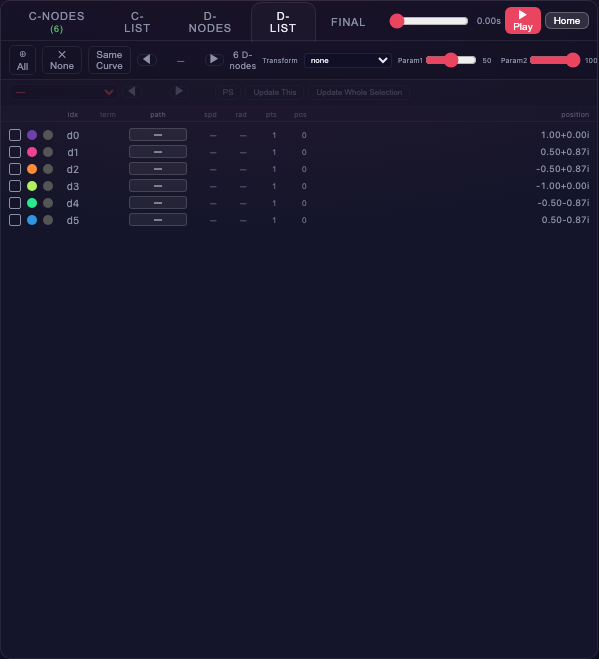

Identical structure to the C-List tab, but for morph target D-nodes. Assign paths, speeds, and transforms to D-nodes independently from C-coefficients. The toolbar (`#dcoeff-list-toolbar`) has the same controls: Select All (`#dlist-select-all-btn`) / Deselect (`#dlist-deselect-all-btn`), Same Curve (`#dlist-all-curves-btn`), curve type cycler (prev/next arrows, label `#dlist-curve-cycle`), selection count (`#dlist-count`), Transform dropdown (`#dlist-transform`), and Param1 (`#dlist-sel-speed`) / Param2 (`#dlist-sel-param2`) sliders. The curve editor (`#dlist-curve-editor`) uses the same pattern: select D-nodes, adjust parameters via dropdown `#dle-path-sel` and controls `#dle-controls`, and click **Update Whole Selection** (`#dle-update-sel`) to apply. D-nodes have an additional **Follow C** path type that mirrors the corresponding C-node's position (no speed or radius displayed). See [D-Node Paths](d-node-paths.md).

### Jiggle Tab

Dedicated tab for coefficient perturbation controls (`#jiggle-content`).

- **Mode** dropdown (12 modes, see below)
- Mode-specific parameter controls (sigma, steps, amplitude, period, etc.)
- **Interval** slider (0.1-100 seconds, step 0.1, between perturbation triggers) with **-0.1** / **+0.1** precision buttons
- **GCD** button: auto-compute interval from the GCD of coefficient speeds

**Jiggle modes** (12):

| Mode | Description | Parameters |
|------|-------------|------------|
| None | No perturbation | -- |
| Random | Gaussian offsets each trigger | sigma (range slider 0-10, **-0.01** / **+0.01** buttons) |
| Rotate | Rotate selected around centroid | steps (range slider 10-5000, **-1** / **+1** / **P** (nearest prime) buttons) |
| Walk | Random walk accumulating offsets | sigma (range slider 0-10, **-0.01** / **+0.01** buttons) |
| Scale (center) | Scale from origin | growth % per trigger |
| Scale (centroid) | Scale from centroid | growth % per trigger |
| Circle | Rotate around origin | steps (range slider 10-5000, **-1** / **+1** / **P** buttons) |
| Spiral (centroid) | Rotate + scale around centroid | steps (10-5000, **-1** / **+1** / **P** buttons), growth % |
| Spiral (center) | Rotate + scale around origin | steps (10-5000, **-1** / **+1** / **P** buttons), growth % |
| Breathe | Sinusoidal scaling from centroid | amplitude, period (cycles) |
| Wobble | Sinusoidal rotation around centroid | steps (10-5000, **-1** / **+1** / **P** buttons), period (cycles) |
| Lissajous | Translate along Lissajous figure | amplitude, steps (range slider 10-5000 for period, **-1** / **+1** / **P** buttons), freqX, freqY |

See [Paths](paths.md) for jiggle formulas.

### Final Tab


Shows the actual coefficients sent to the solver (blended C/D positions when morphing is enabled). Located in `#final-content`.

- **Morph** checkbox (`#morph-enable`): enable/disable morph blending
- **Rate** slider (`#morph-rate`, range 1-200, maps to 0.01-2.00 Hz): morph oscillation frequency
- **Rate display** (`#morph-rate-val`): current Hz value
- **mu** display (`#morph-mu-val`): current blend parameter (0=C, 1=D)
- SVG complex-plane visualization (`#final-panel`) of the final blended coefficients

---

## Mid-bar Operations


Located between the left and right panels (`.mid-bar`). Buttons brighten when a selection exists.

| Tool | ID | Control | Description |
|------|----|---------|-------------|
| **Scale** | `#scale-tool-btn` | Vertical slider, exponential mapping | Scale uniformly (0.1x - 10x) |
| **Scale Re** | `#scale-re-tool-btn` | Vertical slider | Scale only the real component |
| **Scale Im** | `#scale-im-tool-btn` | Vertical slider | Scale only the imaginary component |
| **Rotate** | `#rotate-tool-btn` | Horizontal slider | Rotate (+/-0.5 turns) |
| **Translate** | `#add-tool-btn` | 2D vector pad | Translate (+/-2 in each axis) |
| **Shape** | `#shape-tool-btn` | Shape chips + slider | Morph selected positions toward a target shape (Box, Tri, Infinity, Pent). Slider controls blend (0-100%). |
| **Pattern** | `#ptrn-tool-btn` | Pattern dropdown + params + Accept | Arrange selected positions on a geometric pattern. 21 patterns: Circle, Square, Triangle, Pentagon, Hexagon, Diamond, Star, Ellipse, Infinity, Spiral, Grid, Line, Wave, Cross, Heart, Lissajous, Rose, 2 Circles, 2 Squares, Ring, Scatter. 13 patterns have adjustable parameters (e.g. Star inner radius, Grid columns, Lissajous frequencies) shown as sliders below the dropdown. Uses **Accept/Revert**: click Accept to commit, or close/Escape to revert. See [Patterns](patterns.md#pattern-arrange-tool-mid-bar). |

Scale, Scale Re, Scale Im, Rotate, and Translate open transient popovers with live drag-to-apply preview. Shape opens a slider popup. Pattern opens an Accept/Revert popup. All close by clicking outside or pressing Escape.

The tools operate on whichever node kind is currently selected (C-coefficients, D-nodes, or roots). A colored indicator label (`#ops-target`) shows the target: **C** (green), **D** (blue), **roots** (red), or **none** (grey). The `#ops-group` div gets a `disabled` class when nothing is selected.

Additional controls:
- **Select All** (`#mid-all-btn`) / **Deselect** (`#mid-none-btn`) -- context-aware: selects all D-nodes if any D-node is selected, all roots if any root is selected, otherwise all coefficients
- **Inv** (`#inverse-btn`) -- reverse coefficient order (reflects roots around the unit circle)

---

## Right Panel

The right panel has four tabs: Roots, Stats, Sound, Bitmap. Recording controls sit in the tab bar.

### Recording Controls

Located in the right panel tab bar (`span.tab-bar-controls`):

| Control | ID | Description |
|---------|----|-------------|
| **Mode selector** | `#rec-mode` | Roots, Coeffs, Both, Stats, Sound, Bitmap, or Full. "Both" is tab-aware -- renders coefficients plus the active right-side tab. |
| **Record** button | `#rec-roots-btn` | Start WebM video capture. |
| **Stop** button | `#stop-roots-btn` | Stop recording (hidden until recording starts). |

**Auto-stop:** When Trails are enabled, recording auto-stops on loop completion.

### Roots Tab

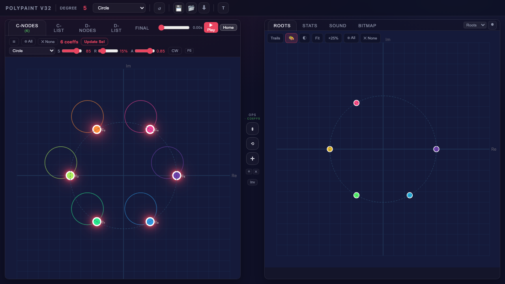

Interactive SVG complex-plane visualization of polynomial roots (`#roots-panel` inside `#roots-container`, with `#domain-canvas` behind it for domain coloring).

**Roots toolbar** (`#roots-toolbar`):


| Control | ID | Description |
|---------|----|-------------|
| **Trails** | `#trails-btn` | Toggle root trail recording. Loop detection auto-stops after one full cycle. Jump detection breaks trails at root-identity swaps (>30% of visible range). |
| **Color** | `#root-color-btn` | Opens a root coloring popover (`#color-pop`). Controls animation dots only (bitmap coloring is independent). |
| **Domain** | `#domain-toggle-btn` | Toggle domain coloring on the roots canvas background. HSL-mapped: hue = argument, saturation = magnitude. |
| **Fit** | `#roots-fit-btn` | Auto-zoom to fit all roots and trails. |
| **-25%** | `#roots-zoom-in-btn` | Zoom in by 25%. |
| **+25%** | `#roots-zoom-out-btn` | Zoom out by 25%. |
| **Select All** | `#select-all-roots-btn` | Select all roots. |
| **Deselect** | `#deselect-all-roots-btn` | Deselect all roots. |

#### Root Color Popup

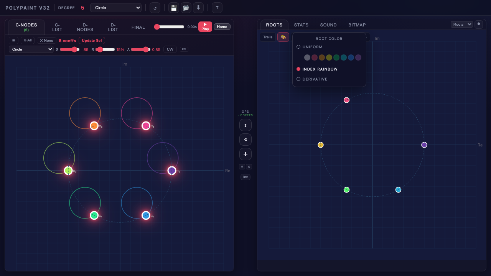

**Animation root color modes** (3):

| Mode | Description |
|------|-------------|
| Uniform | Single color from 8-color swatch (White, Red, Orange, Yellow, Green, Cyan, Blue, Purple) |
| Index Rainbow | Color by root index using d3 rainbow spectrum |
| Derivative | Jacobian sensitivity: blue (stable) through white to red (volatile) |

#### Domain Coloring

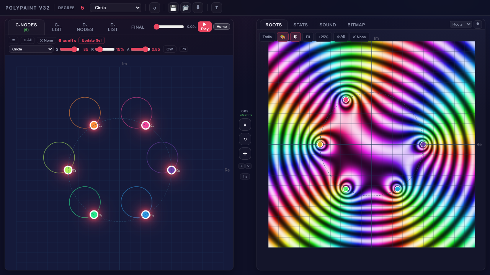

HSL-mapped complex landscape on the roots panel background. Hue represents the argument (phase) of p(z) and brightness represents the magnitude. Roots appear as points where all colors converge.

#### Trails

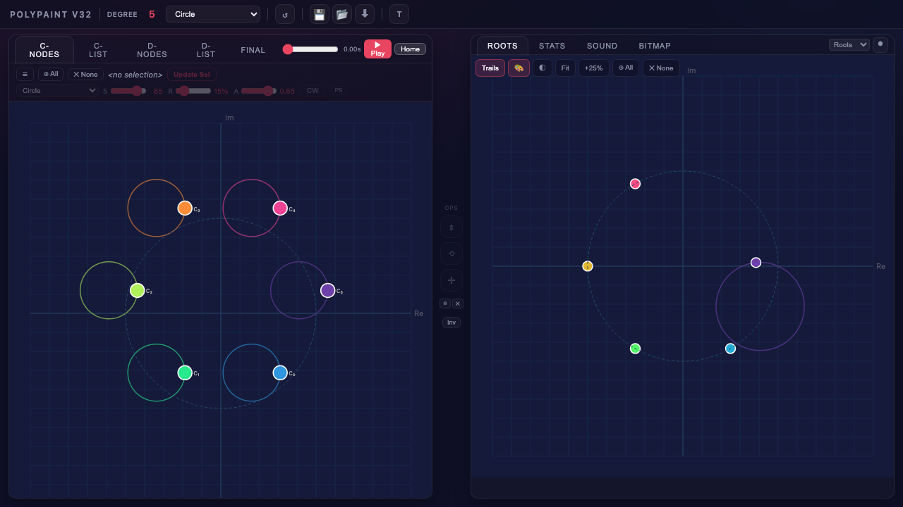

Root trails record positions as colored SVG paths during animation. Loop detection auto-stops after one full cycle. Jump detection breaks trails at root-identity swaps.

- **Drag any root** to move it; coefficients update on the left via inverse reconstruction.
- During root drag, a dashed polyline connects coefficient dots, visualizing the coefficient chain.
- **Marquee select** works the same as on the coefficients panel.

### Stats Tab

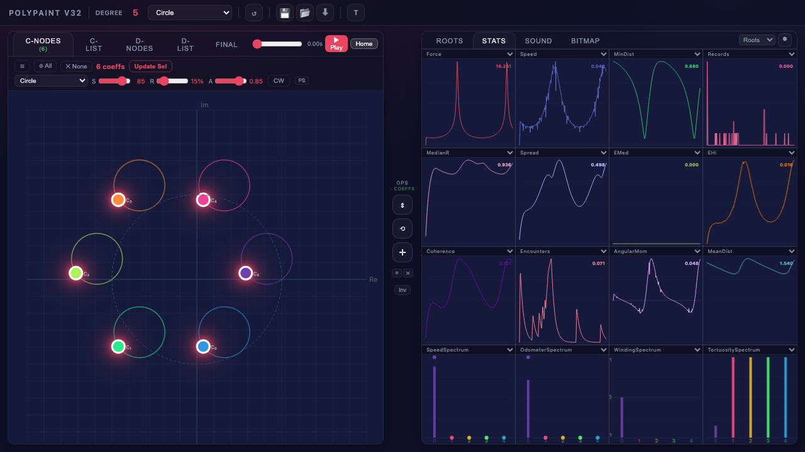

A 4x4 grid of 16 configurable plots. Each plot has a dropdown to select from 32 chart types:

**Time-series (23):**

| Stat | Description |
|------|-------------|
| Force / MinForce / MaxForce | Jacobian sensitivity per root |
| Speed / MinSpeed / MaxSpeed | Root displacement magnitudes |
| MinDist / MaxDist / MeanDist | Pairwise root distances |
| delta-MeanDist / sigma-Dist | Distance rate-of-change and spread |
| Records | Close-approach record-breaking events |
| AngularMom | Signed rotational momentum |
| sigma-Speed / EMASpeed | Speed statistics |
| Odometer / CycleCount | Cumulative distance and cycle detection |
| MedianR / Spread | Median radius, 90th-10th percentile spread |
| EMed / EHi | 50th / 85th percentile speeds |
| Coherence | Angular clustering measure |
| Encounters | Per-root close-approach events |

The last 6 (MedianR through Encounters) are sonification features with EMA smoothing matching the audio pipeline.

**Phase-space (5):** Force vs Speed, MinDist vs MaxDist, MinSpeed vs MaxSpeed, MeanDist vs sigma-Dist, MaxForce vs MaxSpeed

**Spectrum (4):** SpeedSpectrum, OdometerSpectrum, WindingSpectrum, TortuositySpectrum (per-root bar charts with all-time peak dots)

Data is collected every frame into a 4000-frame ring buffer.

### Sound Tab

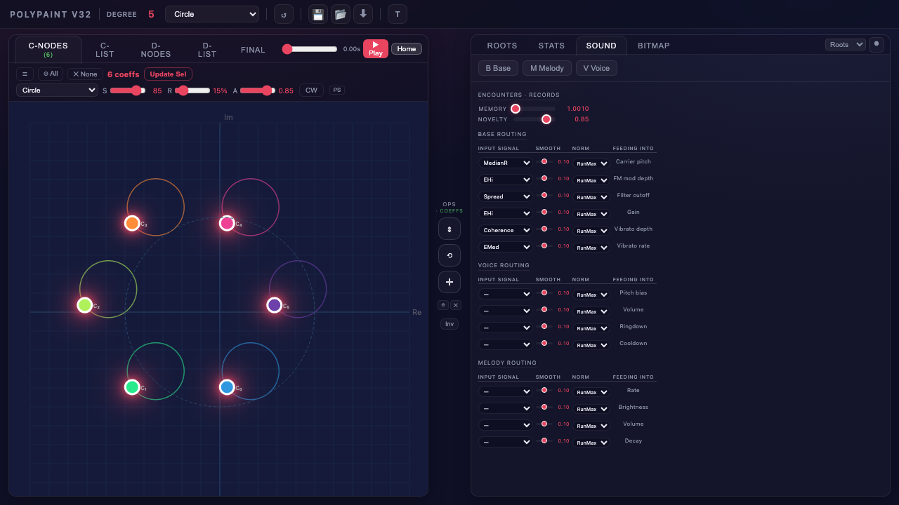

Three independent audio layers, each with a toggle button and config popover (`#audio-pop`). See [Sonification](sonification.md) for the full algorithm, audio graph, and signal routing matrix.

| Voice | ID | Type | Key Parameters |
|-------|----|------|---------------|
| **B** Base | `#base-toggle-btn` | FM drone | Pitch (55-440 Hz), Range, FM Ratio, FM Depth, Brightness, Volume, Vibrato |
| **M** Melody | `#melody-toggle-btn` | Pentatonic arpeggiator | Rate (2-60 notes/s), Cutoff, Volume, Attack, Decay, Brightness |
| **V** Voice | `#voice-toggle-btn` | Encounter beeps | Cooldown (10-500 ms), Volume, Attack, Decay |

The Sound tab also exposes a **signal routing matrix** (`#config-sliders`): any of 25 computed stats can be patched into any of 14 audio parameters, with per-route normalization (Fixed or adaptive RunMax) and EMA smoothing.

### Bitmap Tab

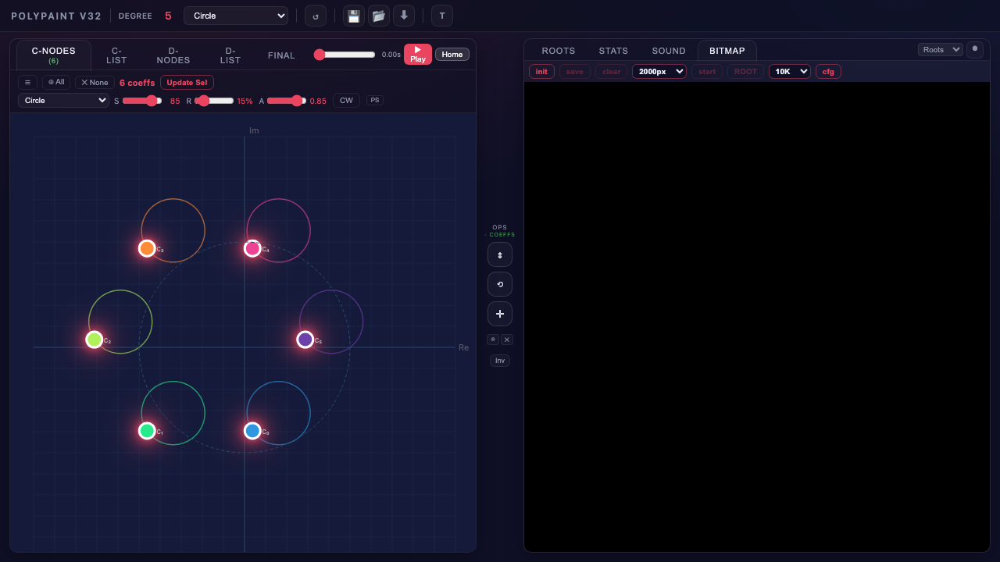

Accumulates root (or coefficient) positions as single-pixel stamps on a high-resolution canvas (`#bitmap-canvas` inside `#bitmap-container`).

**Toolbar (`#bitmap-toolbar`):**


| Control | ID | Description |
|---------|----|-------------|
| **init** | `#bitmap-start-btn` | Snapshot animation state, create bitmap canvas, reset elapsed to 0. |
| **save** | `#bitmap-save-btn` | Open format popup (`#bitmap-save-pop`): JPEG (with quality slider), PNG, BMP, TIFF. Downloads from CPU buffer at full resolution. |
| **clear** | `#bitmap-clear-btn` | Reset canvas pixels. Elapsed time unchanged. |
| **Resolution** | `#bitmap-res-select` | Canvas size: 1000 / 2000 / 5000 / 8000 / 10000 / 15000 / 25000 px. Above 2000px, display is capped at 2000px while computation runs at full resolution. Auto-restarts fast mode if changed during active rendering. |
| **start / stop** | `#bitmap-fast-btn` | Toggle continuous fast mode (parallel Web Workers). Stop preserves state; start resumes where it left off. |
| **ROOT / COEF** | `#bitmap-coeff-btn` | Toggle between plotting root or coefficient positions. |
| **Steps** | `#bitmap-steps-select` | Solver steps per pass: 10 / 100 / 1K / 5K / 10K / 50K / 100K / 1M. Auto-restarts fast mode if changed during active rendering. |
| **cfg** | `#bitmap-cfg-btn` | Open configuration popup (see below). |
| **-25%** | `#bitmap-zoom-in-btn` | Zoom in bitmap view by 25%. |
| **+25%** | `#bitmap-zoom-out-btn` | Zoom out bitmap view by 25%. |
| **Zoom label** | `#bitmap-zoom-label` | Current bitmap zoom level (e.g. `1.00x`). |
| **Pass count** | `#bitmap-pass-count` | Zero-padded elapsed-seconds counter shown during computation. |

#### Bitmap Rendering

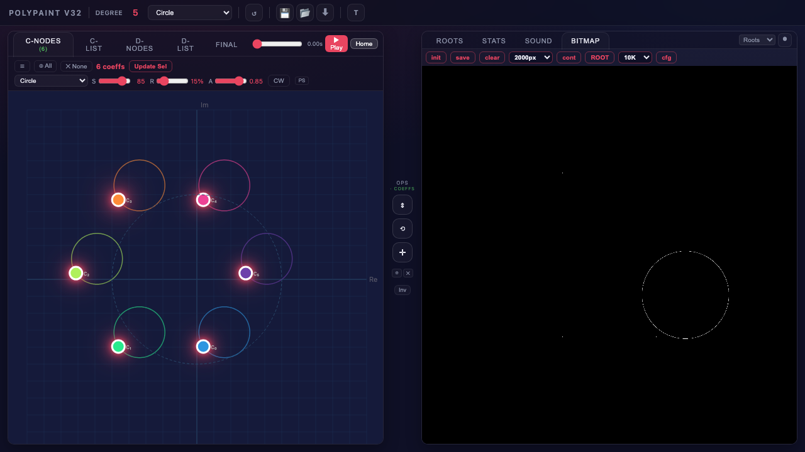

After clicking **init** and **start**, parallel Web Workers continuously solve the polynomial and plot root positions as pixels on the bitmap canvas.

#### Bitmap Save Popup

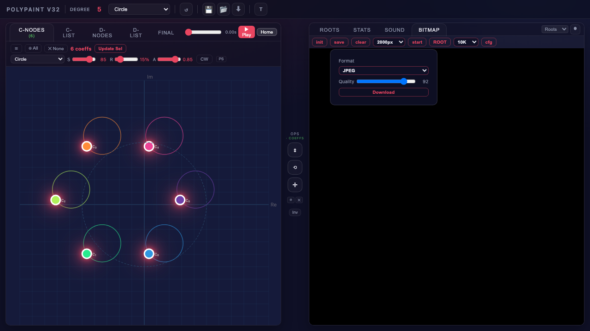

Four export formats: JPEG (with quality slider), PNG, BMP, TIFF. The image is exported at full compute resolution, not the display-capped resolution.

#### Configuration Popup (cfg)

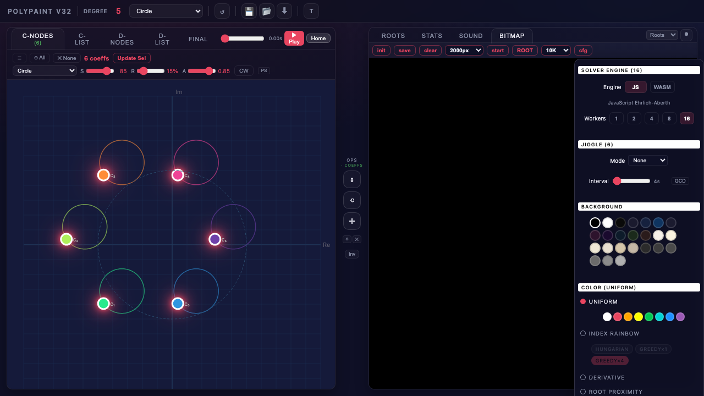

| Setting | Options |
|---------|---------|
| **Solver engine** | JavaScript or WebAssembly. See [WASM](wasm_investigation.md). |
| **Workers** | Number of parallel Web Workers: 1, 2, 4, 8, 16. |
| **Background color** | 24 preset colors (darks, lights, grays). |
| **Root color** | 6 bitmap color modes (see below). Independent from animation root coloring. |

Jiggle controls have moved to the dedicated [Jiggle tab](#jiggle-tab) in the left panel.

**Bitmap color modes** (6):

| Mode | Description | Palette / Options |
|------|-------------|-------------------|
| Uniform | Single fixed color | 8-color swatch |
| Index Rainbow | Color by root index | d3 rainbow spectrum + matching strategy chips |
| Derivative | Jacobian sensitivity | 16-entry blue-white-red |
| Root Proximity | Min distance to nearest root | Sequential palette from catalog (8 options) |
| Idx x Prox | Index Rainbow hue modulated by proximity brightness | Matching strategy chips + gamma slider (0.1-1.0) |
| Min/Max Ratio | Ratio of min/max root distance | Sequential palette from catalog (8 options) + gamma slider (0.1-1.0) |

**Proximity palette catalog** (used by Root Proximity and Min/Max Ratio modes): Inferno (default), Viridis, Magma, Plasma, Turbo, Cividis, Warm, Cool. Each renders as a gradient circle in the cfg popup; clicking selects the palette and switches to the corresponding mode.

**Root-matching strategies** (used by Index Rainbow and Idx x Prox modes):

| Strategy | Algorithm | Cost | Accuracy |
|----------|-----------|------|----------|
| Hungarian | Kuhn-Munkres optimal assignment | O(n^3) every step | Perfect |
| Greedy x1 | Nearest-neighbor | O(n^2) every step | Good |
| Greedy x4 | Nearest-neighbor every 4th step | O(n^2) / 4 | Slight drift (default) |

---

## Popups Reference

All popups use the `.ops-pop` CSS class, positioned via `getBoundingClientRect()`, toggled via `.open` class.

| Popup | ID | Opened By |
|-------|----|-----------|
| Operations tool | `#ops-pop` | Mid-bar tool buttons (Scale, Rotate, Translate, Shape, Pattern) |
| Degree slider | `#degree-pop` | Clicking degree number |
| Audio config | `#audio-pop` | Sound voice toggle buttons (B, M, V) |
| Root color | `#color-pop` | Root color button in roots toolbar |
| Coefficient picker | `#coeff-pick-pop` | Coefficient picker button in anim bar |
| C-node context menu | `#coeff-ctx` | Right-click on a coefficient dot |
| D-node context menu | `#dnode-ctx` | Right-click on a D-node dot |
| Export | `#snap-pop` | Export button in header |
| C-List path picker | `#path-pick-pop` | Clicking path cell in C-List table |
| D-List path picker | `#dpath-pick-pop` | Clicking path cell in D-List table |
| Timing stats | `#timing-pop` | T button in header |
| Bitmap config | `#bitmap-cfg-pop` | cfg button in bitmap toolbar |
| Bitmap save format | `#bitmap-save-pop` | save button in bitmap toolbar |

---

## Selection Model

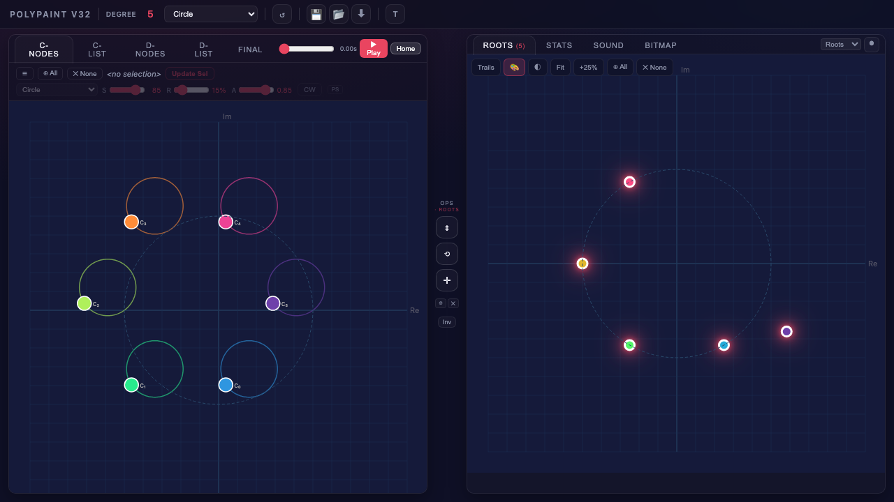

- **Click** any dot to toggle it into the selection.
- **Marquee select:** Click and drag on empty canvas to draw a selection rectangle.
- **Select All / Deselect** buttons in the trajectory editor bar, C-List/D-List toolbars, roots toolbar, and mid-bar.
- Selected nodes pulse with a bright glow.
- **Mutually exclusive selection:** Only one kind of node can be selected at a time. Clicking a C-node clears any D-node and root selections; clicking a D-node clears C-node and root selections; clicking a root clears C-node and D-node selections.
- The **Ops** label in the mid-bar shows a colored indicator (`#ops-target`) reflecting the active selection kind:
  - **C** (green `#5ddb6a`) -- C-coefficients selected
  - **D** (blue `#4ea8de`) -- D-nodes selected
  - **roots** (red `#e94560`) -- roots selected
  - **none** (grey `#888`) -- nothing selected
- The trajectory editor displays the first selected coefficient's settings (by index). Adjusting controls shows a live preview; click **Update Whole Selection** to commit or click away to revert.
- Selection count appears in tab headers: green for coefficients (`#coeff-sel-count` in C-Nodes tab), D-nodes (`#morph-sel-count` in D-Nodes tab), and jiggle targets (`#jiggle-sel-count` in Jiggle tab); red for roots (`#roots-sel-count`).

---

## Recording

| Control | Description |
|---------|-------------|
| **Record** button (`#rec-roots-btn`) | Start WebM video capture. |
| **Stop** button (`#stop-roots-btn`) | Stop recording. |
| **Mode selector** (`#rec-mode`) | Roots, Coeffs, Both, Stats, Sound, Bitmap, or Full. "Both" is tab-aware -- renders coefficients plus the active right-side tab. |
| **Auto-stop** | When Trails are enabled, recording auto-stops on loop completion. |

---

## Keyboard

| Key | Action |
|-----|--------|
| **Escape** | Cascading close: (1) revert animation bar preview, (2) close C-node context menu, (3) close D-node context menu, (4) close ops tool popover, (5) close audio popup, (6) close color picker, (7) close coefficient picker, (8) close snap popup, (9) close bitmap cfg, (10) close path picker, (11) deselect all. Stops at the first match. |

---

## Regenerating Screenshots

The screenshots in this guide were captured programmatically using Playwright. To regenerate them:

```bash
python docs/capture_interface.py
```
