# Patterns

## Basic (5)

| Pattern | Description |
|---------|-------------|
| Circle | Evenly spaced on a circle |
| Real axis | Along the real axis |
| Imaginary axis | Along the imaginary axis |
| Grid | Square grid arrangement |
| Random | Uniformly random |

## Coefficient Patterns (8)

| Pattern | Description |
|---------|-------------|
| Spiral | Archimedean spiral |
| Star | Alternating inner/outer radii |
| Figure-8 | Bernoulli lemniscate |
| Conjugate pairs | Pairs straddling the real axis |
| Two clusters | Two separate clusters |
| Geometric decay | Alternating-sign geometric series |
| Rose curve | 3-petal rose r = cos(3θ) |
| Cardioid | Heart-shaped curve |

## Root Shapes (13)

These define the *roots* in a specific shape, then compute the coefficients by expanding the product. Dragging the resulting coefficients perturbs the roots away from the initial shape:

Heart, Circle, Star, Spiral, Cross, Diamond, Chessboard, Smiley, Figure-8, Butterfly, Trefoil, Polygon, Infinity

## Path Catalog

Animation path types are defined in `PATH_CATALOG`, the single source of truth for all path `<select>` elements. Each entry is either a top-level option (`{ value, label }`) or an `<optgroup>` (`{ group, items: [...] }`). Entries may carry a `dOnly: true` flag, indicating they appear only in D-node path selectors.

| Group | Paths |
|-------|-------|
| *(top-level)* | None |
| *(top-level, D-only)* | Follow C |
| Basic | Circle, Horizontal, Vertical, Spiral, Gaussian cloud |
| Curves | Lissajous, Figure-8, Cardioid, Astroid, Deltoid, Rose (3-petal), Spirograph, Hypotrochoid, Butterfly, Star (pentagram), Square, C-Ellipse |
| Space-filling | Hilbert (Moore), Peano, Sierpinski |

Dithered variants (`-dither` suffix) are auto-inserted after each base path in catalog groups. Random and Follow-C have no dithered variant.

### Follow-C (D-node only)

The **Follow C** path type is exclusive to D-nodes (`dOnly: true`). A D-node with this path copies the position of its corresponding C-coefficient each frame instead of following its own trajectory. It has no parameters (`PATH_PARAMS["follow-c"] = []`) and no curve of its own — its curve is a single-point array at its current position. In fast-mode workers, Follow-C indices are serialized as `dFollowCIndices` and the worker copies `coeffsRe[i]`/`coeffsIm[i]` into the morph target arrays each step.

### buildPathSelect(sel, noneLabel, dNode)

Populates a `<select>` element from `PATH_CATALOG`. The optional `noneLabel` overrides the "None" text (e.g. "—" for list editors). The `dNode` flag (third parameter) includes D-only entries when `true`. Called three times at init:

- `buildPathSelect(document.getElementById("anim-path"))` — anim-bar, no D-only
- `buildPathSelect(document.getElementById("lce-path-sel"), "—")` — C-List editor, no D-only
- `buildPathSelect(document.getElementById("dle-path-sel"), "—", true)` — D-List editor, includes Follow C

## Selection Model

Selection is **mutually exclusive** across three pools: C-coefficients (`selectedCoeffs`), D-nodes (`selectedMorphCoeffs`), and roots (`selectedRoots`). Clicking a node in one pool clears the other two. The three `Set` objects are managed by `clearCoeffSelection()`, `clearMorphSelection()`, `clearRootSelection()`, and `clearAllSelection()`.

### Ops Bar Indicator

The ops bar shows a colored target label (`#ops-target`) reflecting which pool is active:

| State | Label | Color |
|-------|-------|-------|
| No selection | `· none` | gray `#888` |
| C-coefficients selected | `· C` | green `#5ddb6a` |
| D-nodes selected | `· D` | blue `#4ea8de` |
| Roots selected | `· roots` | red `#e94560` |

When no selection exists, the ops group is disabled (`#ops-group.disabled`).

### Ops Tools on D-nodes

The mid-bar **Scale**, **Rotate**, and **Translate** tools operate on whichever pool is active. `snapshotSelection()` returns `{ which: "coeff"|"morph"|"roots", items }` depending on which `Set` is non-empty (checked in priority order: C, then D, then roots). `applyPreview()` dispatches to the correct data array: `coefficients[]` for "coeff", `morphTargetCoeffs[]` for "morph", `currentRoots[]` for "roots". After transforming D-nodes, curves with `pathType === "follow-c"` get a single-point curve at the new position; all other D-node curves are recomputed via `computeCurve()`.

## Parameter Ranges

### Speed

Speed is stored internally as a float (0.001–1.0) and displayed/edited as an integer (1–1000) via `toUI: v => Math.round(v * 1000)` and `fromUI: v => v / 1000`. Resolution is **1/1000** of a full loop per second. The speed slider in C-List and D-List selection bars has `min="1" max="1000" step="1"`.

### Param2

The param2 slider (used by LerpSpeed, LerpRadius, LerpAngle transforms) has range **1–1000** with step 1, in both C-List (`#list-sel-param2`) and D-List (`#dlist-sel-param2`).

### Jiggle Controls

| Control | Range | Step | Notes |
|---------|-------|------|-------|
| σ (sigma) | 0–10 | 0.01 | `jiggleSigma`; read as `jiggleSigma / 10` (fraction of `coeffExtent()`). Backward compat: old 0–100 values are divided by 10 on load. |
| Steps (rotate/circle/spiral/wobble) | 10–5000 | 1 | `jiggleAngleSteps` or `jiggleCircleSteps`; number of jiggle steps for one full revolution. Replaces the old θ (turns) control. |
| Interval | 0.1–100s | 0.1 | `jiggleInterval`; seconds between jiggle perturbations. |
| Lissajous period | 10–5000 | 1 | `jigglePeriod`; measured in **steps** (not cycles). Slider with `min="10" max="5000"`. |
| Amplitude | 1–50 | 1 | `jiggleAmplitude`; % of `coeffExtent()` or centroid distance. |
| FreqX / FreqY | 1–10 | 1 | Lissajous frequency multipliers. |

## Trail Gallery

  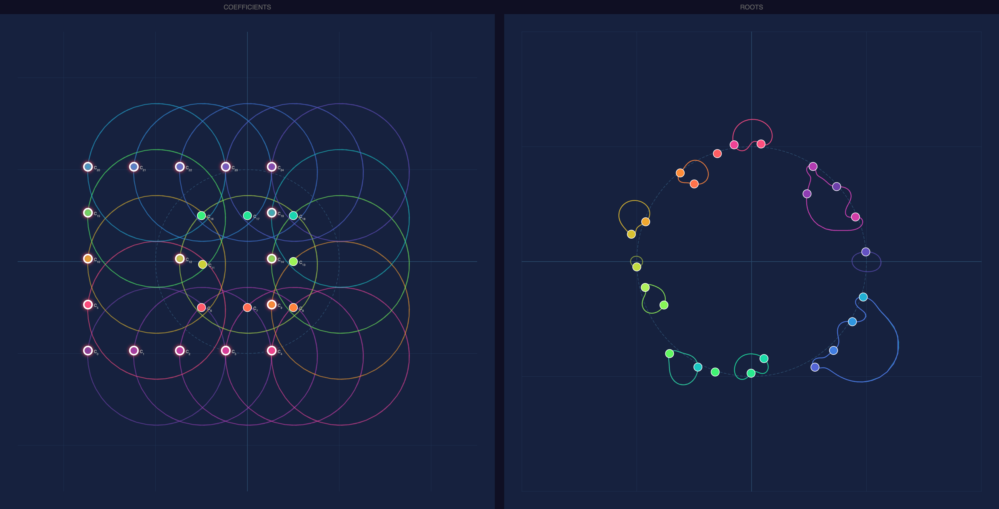

**Degree 24, grid pattern, circle path (one full loop)** — 17 of 25 coefficients orbiting on a circle (radius 0.75, speed 0.5). Left panel shows the coefficient trails — each selected coefficient traces its own circle, creating an overlapping ring pattern from the grid arrangement. Right panel shows the resulting root braids: small loops and cusps where roots nearly collide, large sweeping arcs where roots respond dramatically to the perturbation. The loop detection fired after one complete cycle, stopping trail accumulation automatically.

  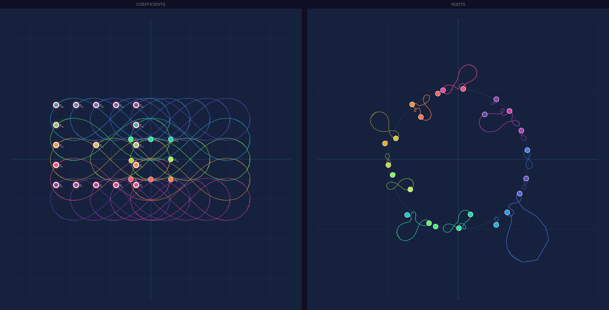

**Degree 24, grid pattern, figure-8 path** — Same 17 coefficients, now following a figure-8 (lemniscate) at radius 1.5. The coefficient trails on the left form a dense weave of overlapping figure-8s. On the right, every root inherits the double-loop character — small figure-8 knots appear throughout, with some roots tracing tight local loops while others sweep wide arcs. The larger radius amplifies the perturbation, pushing roots further and producing more dramatic braiding than the circle path above.

  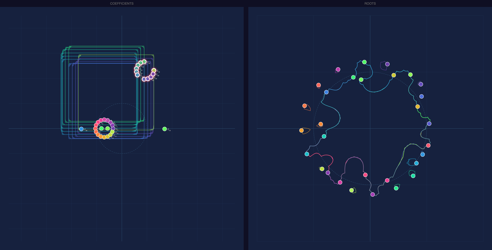

**Degree 30, two-clusters pattern, square path** — 11 of 31 coefficients (from one cluster) following a square path at radius 1.5, speed 0.4. The coefficient trails on the left show nested rectangles — each selected coefficient traces its own square, offset by its position within the cluster. The 30 roots on the right arrange in a large ring with emerging trail segments showing the early stages of the braid. The two-cluster pattern concentrates coefficients into two groups, creating an asymmetric perturbation that pushes some roots into tight local orbits while others track the ring's perimeter.

  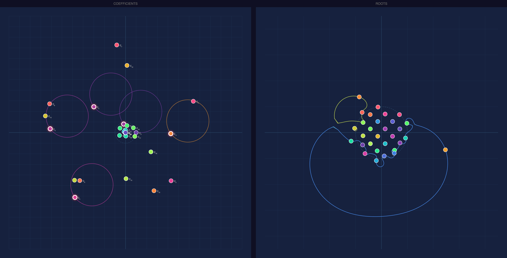

**Degree 30, chessboard root shape, circle path** — Only 5 of 31 coefficients selected, orbiting on a large circle (radius 2.0, speed 0.5). The roots were initialized in a chessboard grid pattern (a root shape, so the coefficients were computed from the grid). On the left, the 5 selected coefficients trace circles of varying sizes depending on their magnitude. On the right, most roots stay clustered near their grid positions while one outlier root swings through a wide arc — a striking demonstration of how perturbing a few high-order coefficients can leave most roots nearly fixed while sending one root on a long excursion.

  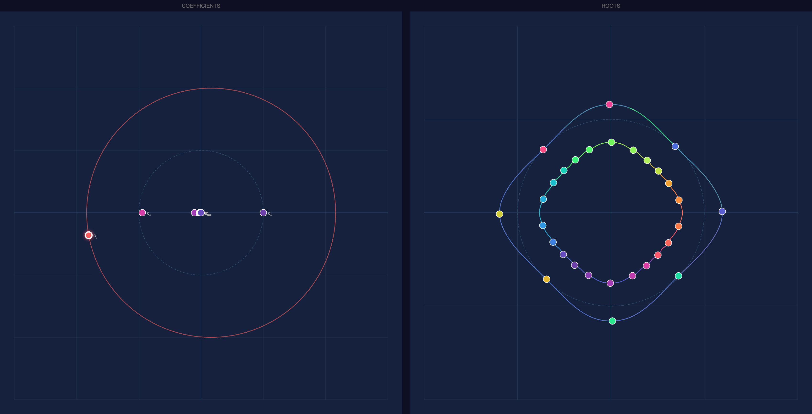

**Degree 30, diamond root shape, circle path** — A single coefficient (c₈) orbiting on a large circle (radius 2.0, speed 0.4). The roots were initialized in a diamond arrangement. On the left, the lone selected coefficient traces one clean circle while the remaining coefficients sit near the origin. On the right, the 30 roots maintain their diamond shape but each traces a smooth rounded-square orbit — the diamond's corners soften into curves as the perturbation sweeps around. The minimal input (one coefficient, one circle) produces a surprisingly coherent collective response: every root moves in concert, preserving the diamond's symmetry while the trail reveals the underlying geometry of the perturbation.

  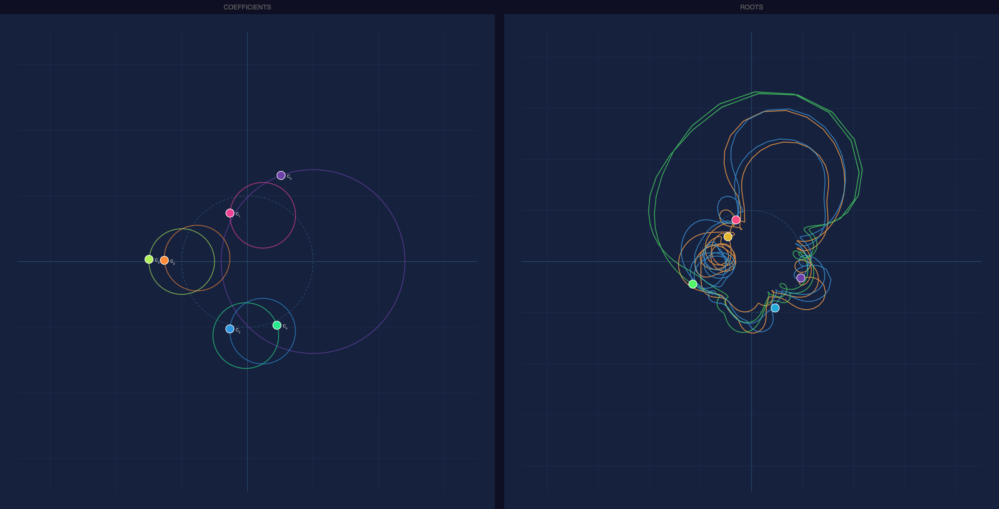

**Degree 5, circle pattern, 6 independent trajectories** — Every coefficient (c₀ through c₅) assigned its own circle trajectory with different configurations: c₀ on a large circle (radius 1.4, speed 0.6, CCW), c₄ barely moving (radius 0.5, speed 0.1, CCW), and the rest at radius 0.5, speed 1.0 with alternating CW/CCW directions. On the left, six circles of varying size show each coefficient's individual orbit. On the right, the 5 roots trace complex entangled loops — the interference between six independent perturbations at different frequencies and directions creates an intricate braid that no single-trajectory animation could produce. The loop detection fired after one complete cycle, confirming the combined motion is periodic.

  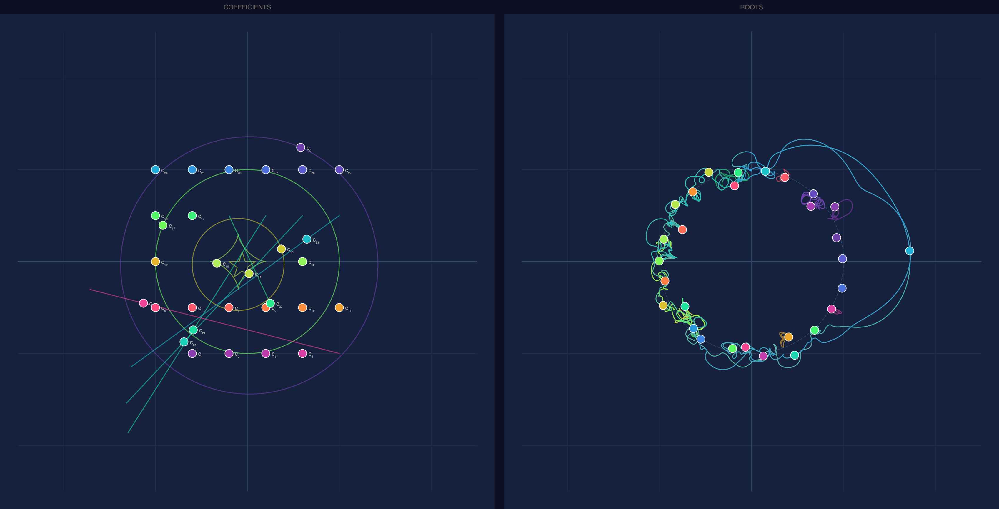

**Degree 29, grid pattern, 10 independent trajectories with mixed shapes and angles** — 10 of 30 coefficients each with their own trajectory: circles (c₀ at radius 1.4, c₁₃ at 0.5, c₁₇ at 1.0), a star (c₁₄ at radius 0.15), an astroid (c₁₅ at 0.3), and four horizontal oscillations (c₂₀–c₂₃ at varying speeds 0.2–0.8) plus c₅ horizontal at angle 0.96. Each trajectory uses a different angle rotation, tilting the shapes relative to each other. On the left, the always-visible coefficient paths show the full variety — circles, a star, an astroid, and angled horizontal lines radiating from their coefficients across the grid. On the right, the 29 root trails form a dense braid around a large ring, with tight cusps where roots nearly collide and sweeping arcs from the combined interference of all 10 perturbations at different frequencies and orientations.

  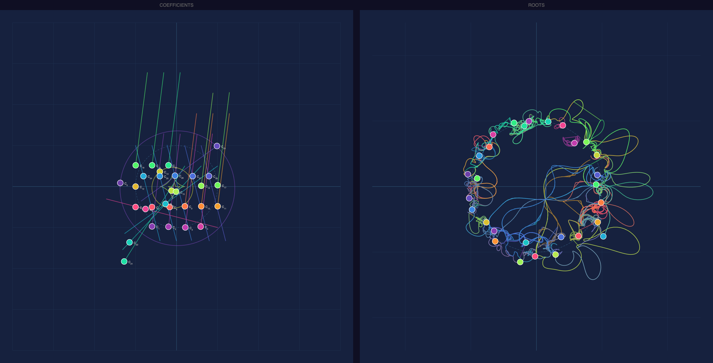

**Degree 29, grid pattern, mass horizontal perturbation** — Building on the previous snap, now with nearly every coefficient animated. Two groups dominate: 12 coefficients (c₁–c₄, c₉–c₁₁, c₁₆–c₂₀) on horizontal trajectories at speed 0.7 with angle 0.73, and 5 coefficients (c₂₄–c₂₈) on faster horizontals at speed 1.2 with angle 0.29. The remaining 4 coefficients keep their circles, star, and astroid from before. On the left, the angled horizontal trajectories form a striking fan of parallel lines across the grid — the angle slider tilts each group's oscillation axis differently. On the right, the root trails explode into tangled loops and whorls: with so many coefficients oscillating at different speeds and angles, the roots are pushed far from equilibrium, producing a chaotic braid where almost every root interacts with its neighbors.

  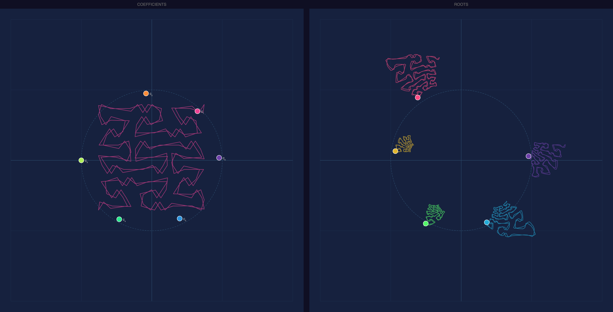

**Degree 5, circle pattern, Peano space-filling path** — A single coefficient (c₁) tracing a Peano curve at radius 0.75, speed 0.1. On the left, the coefficient's path reveals the Peano curve's characteristic zigzag pattern — dense, space-filling, covering the full square around the coefficient. On the right, each of the 5 roots responds by tracing its own miniature space-filling shape: the Peano structure propagates through the polynomial, producing self-similar fractal-like trails at each root position. The slow speed (0.1) allows the trails to accumulate cleanly, showing the full one-cycle braid. A striking demonstration of how a single space-filling perturbation on one coefficient induces fractal geometry across all roots.

  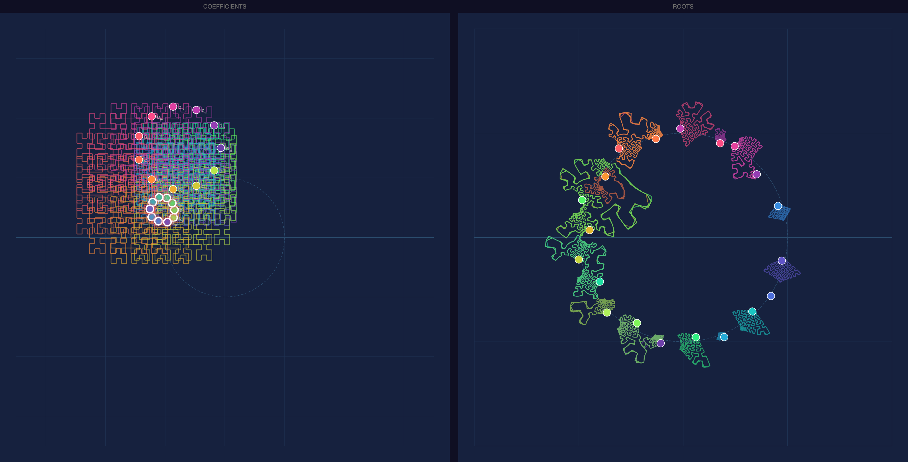

**Degree 20, two-clusters pattern, dual Hilbert (Moore curve) trajectories** — All 21 coefficients animated on Hilbert trajectories at radius 0.65, speed 0.1, with complementary angles (0.75 and 0.25). One group of 10 coefficients from one cluster, the other 11 from the second cluster. On the left, the overlapping Hilbert curves form a dense, layered maze — the two angle rotations tilt the space-filling grids against each other, creating a moiré-like interference pattern. On the right, the 20 root trails each trace their own miniature Hilbert-like fractal, arranged in a large ring. Every root responds to the combined space-filling motion of both coefficient groups, producing intricate self-similar shapes at each root position — some tightly wound, others more open depending on proximity to the coefficient clusters.

  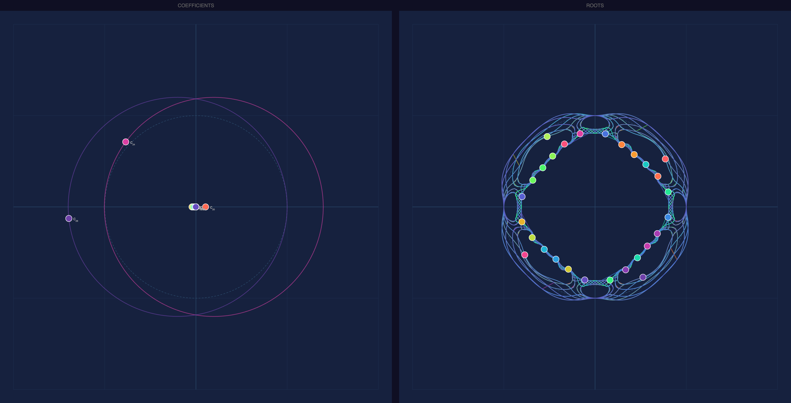

**Degree 28, diamond root shape, dual circle trajectories at different speeds** — Two coefficients animated on independent circles: c₄ at radius 1.2, speed 0.6 (CW, angle 0.5) and c₀ at radius 1.2, speed 0.1 (CCW, angle 1.0). The roots were initialized in a diamond arrangement. On the left, the two coefficient trajectories — one large offset circle (c₀ near the bottom-left) and one near the cluster at center — show the asymmetric perturbation. On the right, the 28 roots maintain a large ring with the diamond's characteristic spacing, but the trails weave an intricate web of fine mesh-like filaments connecting neighboring roots. The speed ratio (6:1) between the two trajectories creates a dense Lissajous-like interference: the fast trajectory drives rapid oscillations while the slow one modulates the overall envelope, producing a cage-like lattice structure around the ring.
