# Tutorial: Capturing Root Trajectories as PNG

This step-by-step guide walks you through creating an animated polynomial, recording its root trajectories, and saving the result as a high-resolution PNG image.

**Time:** ~5 minutes | **Difficulty:** Beginner | **Prerequisites:** A modern browser (Chrome, Firefox, Edge)

---

## 1. Open the App

Open [index.html](../index.html) in your browser, or visit the [live demo](https://nassuphis.github.io/karpo_hackathon/). You'll see the default view: a degree-5 polynomial with coefficients on the left panel and roots on the right.

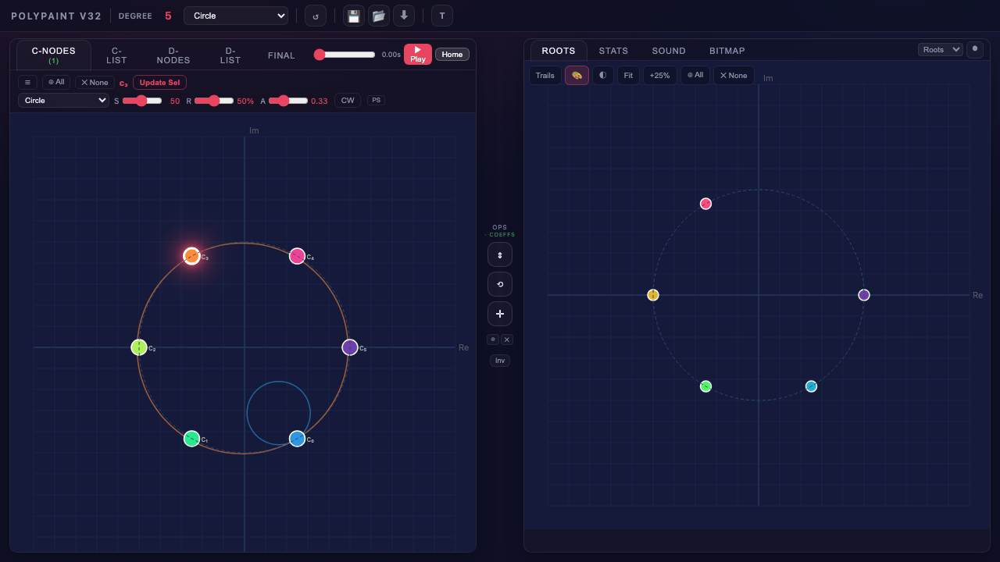

The **left panel** shows the polynomial's coefficients (C-nodes) as colored dots in the complex plane. Each dot can be dragged. The **right panel** shows the computed roots. Between them, the **mid-bar** has transform tools (Scale, Scale Re, Scale Im, Rotate, Translate, Shape morph, Pattern arrange).

The left panel has six tabs: **C-Nodes** (coefficient canvas), **C-List** (coefficient table with transforms), **D-Nodes** (morph target canvas), **D-List** (morph target table), **Jiggle** (perturbation controls), and **Final** (morph blending preview). The right panel has four tabs: **Roots**, **Stats**, **Sound**, and **Bitmap**.

---

## 2. Choose a Starting Pattern

Click the **Pattern** dropdown in the header bar and select **Spiral**. This arranges the coefficients in a spiral layout, which produces more interesting root dynamics than the default circle.

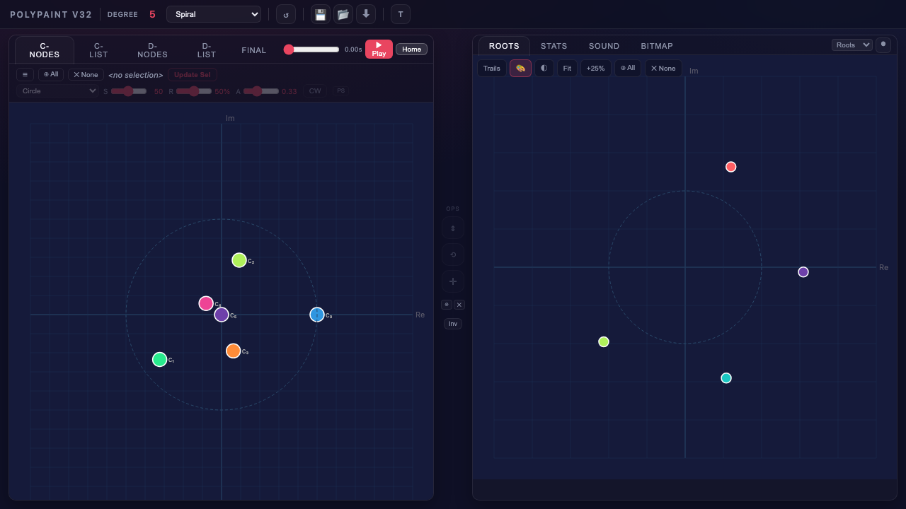

The coefficients reposition themselves and the roots on the right update instantly. PolyPaint includes 26 patterns across three categories (Basic, Coeff patterns, Roots shapes) -- feel free to explore them later.

---

## 3. Select All Coefficients

Click the **All** button in the trajectory editor bar (just below the tab row on the C-Nodes tab, labeled with a circle-plus icon). All coefficient dots light up with a selection glow, and the bar title updates to show the number of selected coefficients.

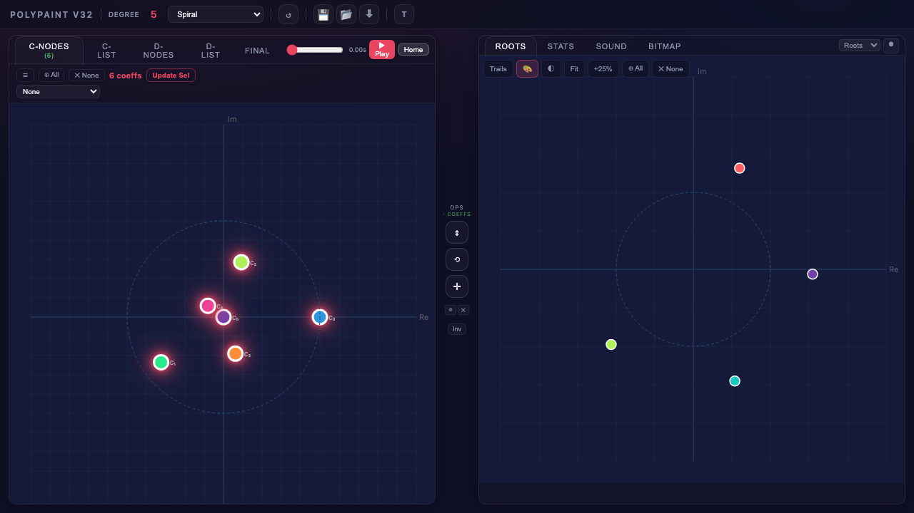

You can also click individual dots to toggle them, or drag on empty canvas to marquee-select a group. Note that C-node, D-node, and root selections are **mutually exclusive** -- selecting in one panel automatically clears any selection in the other panels. For this tutorial, we want all C-coefficients animated.

---

## 4. Assign Circle Paths

With all coefficients selected, open the **path type dropdown** in the trajectory editor bar (currently showing "None" or "Circle") and select **Circle**. Colored circle paths appear around each coefficient, showing the trajectory it will follow during animation.


Each coefficient now has its own circular orbit. The sliders to the right of the dropdown control **S** (speed, 0.001-1.000), **R** (radius, 1-100% of panel range), **A** (starting angle, 0.00-1.00 as a fraction of a full turn), and a **CW/CCW** toggle for direction. You can adjust these per-coefficient or for the whole selection at once by clicking **Update Whole Selection**.

Path types are organized into groups: Basic (Circle, Horizontal, Vertical, Spiral, Gaussian cloud), Curves (Lissajous, Figure-8, Cardioid, Astroid, Deltoid, Rose, Spirograph, Hypotrochoid, Butterfly, Star, Square, C-Ellipse), and Space-filling (Hilbert, Peano, Sierpinski). Each base path also has a dithered variant that adds small random perturbations along the curve.

---

## 5. Set Prime Speeds

To make the animation more interesting, give each coefficient a different speed so the roots trace complex, non-repeating patterns.

1. Click the **C-List** tab to switch to the table view
2. Click **All** in the list toolbar
3. Open the **Transform** dropdown and choose **PrimeSpeeds**

This sets each coefficient's speed to a value coprime with all others, ensuring their orbits never synchronize and the root trajectories fill more of the plane.

Switch back to the **C-Nodes** tab to see the coefficient paths.

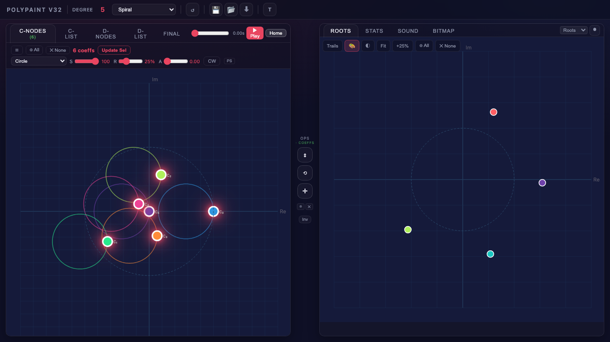

---

## 6. Enable Trails

Click the **Trails** button on the roots toolbar (top of the right panel, on the Roots tab). It highlights when active. This tells PolyPaint to record root positions as SVG paths as the animation plays.

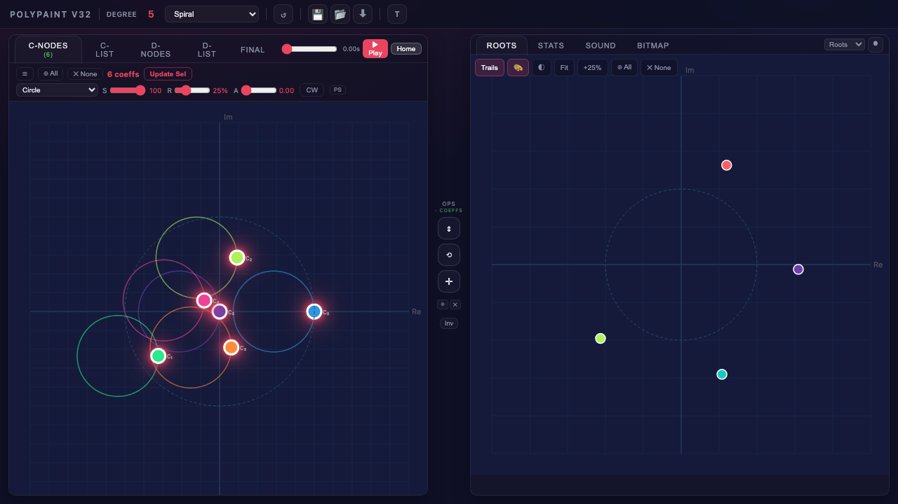

Nothing visible changes yet -- trails appear once the animation starts.

---

## 7. Play the Animation

Click the **Play** button in the header bar. The header bar animation controls are laid out as: scrub slider, Play button, seconds counter, and Home button. The coefficients begin orbiting along their circle paths, and the roots respond by tracing colored trails on the right panel. The seconds counter next to the Play button shows elapsed animation time.

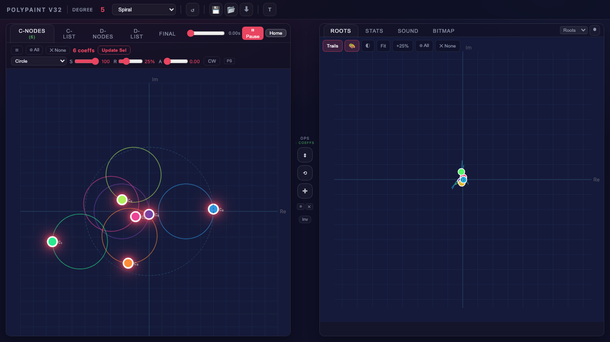

Let it run for several seconds. The trails grow into intricate braid-like patterns as roots chase each other around the plane. The pattern depends on the degree, path types, speeds, and radii.

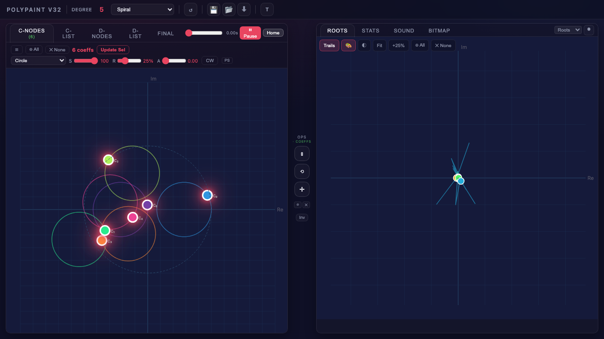

Click the button again (now showing **Pause**) to halt the animation. The button label then changes to **Resume** so you can continue from where you paused. Click **Home** to reset all coefficients and D-nodes to their start positions and clear trails. The Play/Pause cycle is: Play -> Pause -> Resume -> Pause -> Resume -> ...

---

## 8. Export as PNG (Quick Method)

For a quick screenshot of the current view:

1. Click the **Export** button (down arrow icon) in the header bar
2. A popup appears with 7 capture modes

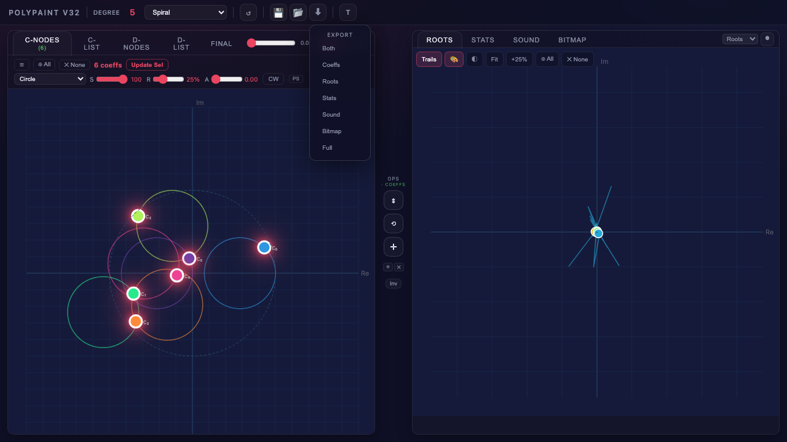

| Mode | What it captures |
|------|-----------------|
| **Both** | Coefficients + active right tab side-by-side |
| **Coeffs** | Left panel only |
| **Roots** | Right panel only (includes trails) |
| **Stats** | Stats dashboard |
| **Sound** | Sound panel |
| **Bitmap** | Bitmap canvas |
| **Full** | Entire app window |

Click **Roots** to save just the root trails as a PNG. The file downloads automatically along with a JSON snapshot of the full app state (so you can recreate this exact setup later).

---

## 9. High-Resolution Bitmap Render

The Export method above captures the screen at display resolution. For publication-quality images at up to 25,000 x 25,000 pixels, use the **Bitmap** tab.

### Initialize

1. Click the **Bitmap** tab on the right panel
2. Click **init** to snapshot the current animation state and create the bitmap canvas

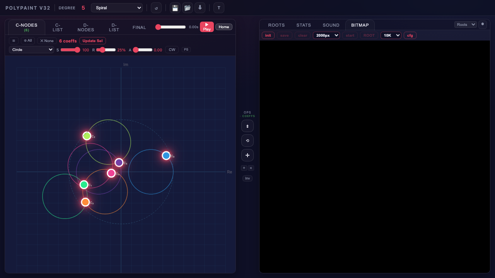

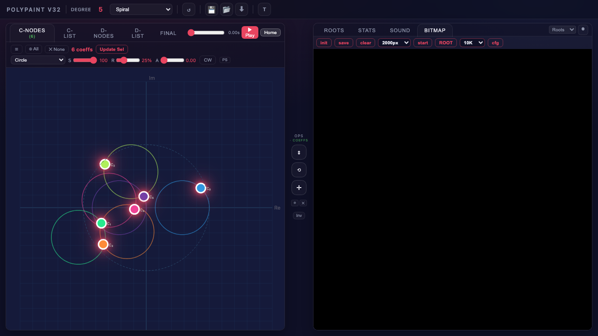

The bitmap canvas appears as a black rectangle. The toolbar shows resolution (default 2000px), step count, and start/pause controls. You can change the resolution dropdown before or after init -- options are 1000, 2000, 5000, 8000, 10000, 15000, and 25000 pixels. The display canvas is capped at 2000px for performance, but the compute buffer runs at the full selected resolution. Changing the resolution or step count while fast mode is running will automatically restart rendering with the new settings.

The toolbar also includes a **ROOT/COEFF** toggle button that switches between plotting root positions (default) and coefficient positions, as well as **zoom controls** (-25% / +25%) for adjusting the bitmap view.

### Render

Click **start** to begin fast-mode rendering. This launches parallel Web Workers that continuously solve the polynomial with the coefficients advancing along their paths, plotting each root position as a pixel on the bitmap.

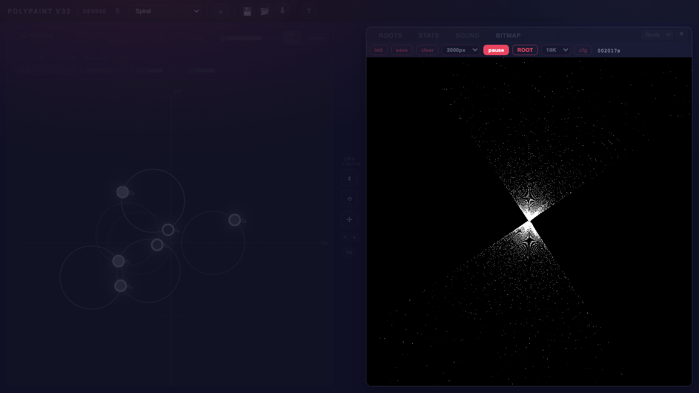

The pass counter ticks up as pixels accumulate. Let it run for 5-30 seconds depending on the resolution and level of detail you want. Higher step counts (configurable via the **steps** dropdown, from 10 to 1M) mean more solver iterations per worker pass.

Click the button again (now showing **pause**) to halt rendering. The accumulated image is preserved. Click **cont** (continue) to resume accumulating more pixels.

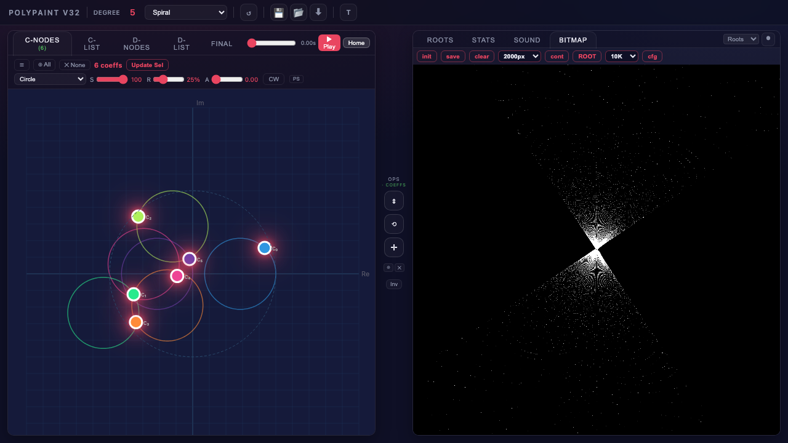

### Save

Click **save** to open the format popup:

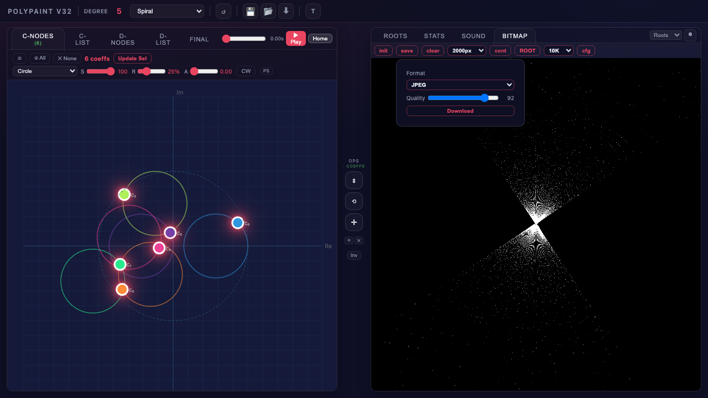

| Format | Best for |
|--------|---------|
| **PNG** | Lossless, often smallest for sparse bitmaps |
| **JPEG** | Lossy with quality slider (50-100) |
| **BMP** | Uncompressed, universal compatibility |
| **TIFF** | Lossless, print workflows |

Select your format and click **Download**. The image is exported at full compute resolution, not the display-capped resolution.

---

## 10. Configure Bitmap Colors and Solver

Click **cfg** on the bitmap toolbar to open the configuration popup. This controls the solver engine, worker count, background color, and root coloring.

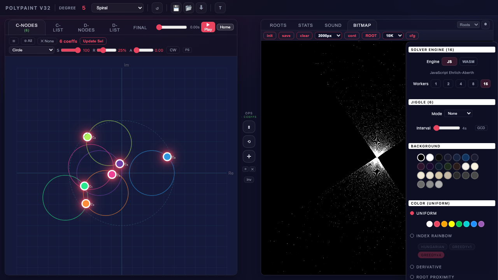

### Solver Engine

Choose between **JS** (JavaScript Ehrlich-Aberth) and **WASM** (compiled C Ehrlich-Aberth). Set the number of parallel **Workers** (1, 2, 4, 8, or 16). Timing data resets when the worker count changes.

### Background Color

Pick from 24 background colors spanning blacks, dark tones, warm whites, and grays. The default is black.

### Color Modes

| Mode | Effect |
|------|--------|
| **Uniform** | All roots plot in a single color (pick from 8 swatches: White, Red, Orange, Yellow, Green, Cyan, Blue, Purple) |
| **Index Rainbow** | Each root gets a distinct rainbow color by index |
| **Derivative** | Colors by Jacobian sensitivity: blue (stable) to red (volatile) |
| **Root Proximity** | Colors by distance to nearest other root, using a selectable d3 palette |
| **Idx x Prox** | Combines index rainbow hue with proximity-based brightness, with adjustable gamma |
| **Min/Max Ratio** | Colors by the ratio of minimum to maximum root distance, with adjustable gamma |

For **Index Rainbow** mode, you can also choose a **matching strategy** (Hungarian, Greedy x1, Greedy x4) that determines how root identities are tracked between solver steps. Hungarian gives optimal tracking but is slower; Greedy x4 is the default and fastest.

For **Root Proximity** mode, choose from 8 d3 palettes displayed as gradient circle swatches: Inferno (default), Viridis, Magma, Plasma, Turbo, Cividis, Warm, and Cool.

For **Idx x Prox** mode, a matching strategy selector and a gamma slider (0.1-1.0) control brightness mapping. Lower gamma spreads the brightness across more of the range.

For **Min/Max Ratio** mode, a proximity palette selector and a gamma slider control the color mapping.

---

## 11. Jiggle (Coefficient Perturbation)

Jiggle adds small perturbations to coefficients between animation cycles, causing the root trajectories to explore nearby parameter space. This fills in sparse areas and creates richer textures in bitmap renders.

Click the **Jiggle** tab on the left panel to access jiggle controls. The controls include:

### Mode

Choose from 12 jiggle modes:

| Mode | Effect |
|------|--------|
| **None** | No perturbation |
| **Random** | Gaussian random offset each cycle |
| **Rotate** | Rotate coefficients around their centroid |
| **Walk** | Random walk (cumulative offsets) |
| **Scale (center)** | Scale from canvas center |
| **Scale (centroid)** | Scale from coefficient centroid |
| **Circle** | Circular offset pattern |
| **Spiral (centroid)** | Spiral around centroid |
| **Spiral (center)** | Spiral around canvas center |
| **Breathe** | Oscillating expansion/contraction |
| **Wobble** | Oscillating rotation |
| **Lissajous** | Lissajous curve offset |

Each mode has its own parameters. Common parameters include **sigma** (perturbation magnitude), **steps** (rotational resolution for directional modes), and period/amplitude controls for oscillating modes. The jiggle interval (seconds between perturbation cycles) is controlled by the fast-mode pass system.

---

## 12. Morph System (D-Nodes)

The morph system lets you blend between two sets of coefficients. The **D-Nodes** tab on the left panel defines morph-target coefficients, mirroring the C-Nodes layout. Morphing **auto-activates** whenever D-nodes exist -- there is no separate checkbox to enable it.

### Setup

1. Click **D-Nodes** to see the morph target canvas
2. Click **Copy C->D** to copy current C-coefficients to D-nodes -- this creates D-nodes and immediately activates morphing
3. Modify the D-node positions by dragging, or assign different animation paths
4. Switch to the **Final** tab to see the blended result -- the **mu** value displayed there shows the current blend factor (0 = pure C, 1 = pure D)

### Configure the C-D Morph Path

The D-Nodes toolbar has three buttons: **Copy C->D**, **Swap C<->D**, and **C-D Path**. Click the **C-D Path** button to open a popup that controls how the blend factor oscillates between the C and D coefficient sets:

- **Path type**: Line (simple back-and-forth), Circle, Ellipse, or Figure-8. Non-line types add a CW/CCW direction toggle.
- **Rate**: Controls oscillation speed (0.0000-0.0100 Hz).
- **Minor** (ellipse only): Minor axis as a percentage of the major axis (10-100%).
- **Dither** (Start/Mid/End sigma): Adds small random perturbations at the start, midpoint, and endpoint of the morph path, which helps fill sparse areas in bitmap renders.

Click **Accept** to confirm changes, or press Escape / click outside to revert.

D-nodes support all the same path types as C-nodes, plus a **Follow C** path type that mirrors the corresponding C-node's position. This makes it easy to set up morph targets that track the main coefficients with offsets.

The **D-List** tab provides the same table interface as C-List, with transforms, path editors, and bulk operations for D-nodes.

---

## Bonus: Domain Coloring

Switch to the **Roots** tab and click the **domain coloring** button (half-circle icon) to overlay an HSL-mapped visualization of the polynomial landscape on the roots panel background.

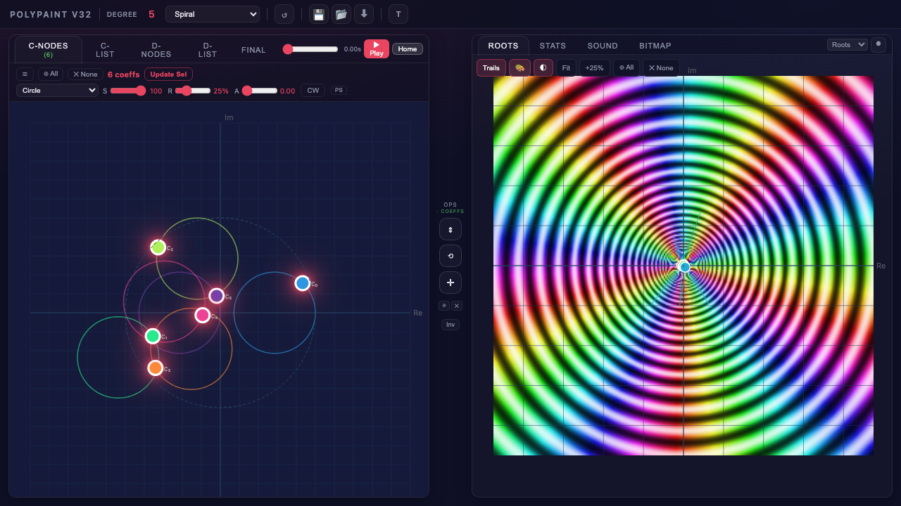

Hue represents the argument (phase) of p(z) and brightness represents the magnitude. Roots appear as points where all colors converge. This provides geometric intuition for why roots move the way they do when coefficients change.

---

## Bonus: Animation Root Colors

Click the **color** button (palette icon) on the roots toolbar to open the root color picker. This controls how roots are colored in the animation panel (separate from bitmap colors):

| Mode | Effect |
|------|--------|
| **Uniform** | All roots in a single color (8 swatches) |
| **Index Rainbow** | Each root gets a distinct rainbow color |
| **Derivative** | Colors by Jacobian sensitivity |

---

## Tips

- **Higher degree = richer patterns.** Click the degree number in the header bar to open a slider (range 2-30). Try degree 10-15 with the Spiral pattern and prime speeds for elaborate braids.
- **Mix path types.** Not every coefficient needs a circle -- try setting some to Lissajous, Figure-8, or Hilbert for more complex dynamics. Dithered variants add subtle randomness along the curve.
- **Use D-nodes for morphing.** The D-Nodes tab defines morph-target coefficients. Morphing auto-activates as soon as D-nodes exist (no checkbox needed). Use the **C-D Path** button to choose a morph path (line, circle, ellipse, figure-8) and set the rate. D-nodes support a **Follow C** path type that mirrors the corresponding C-node's position, making it easy to set up morph targets that track the main coefficients.
- **Use the scrub slider** (in the header bar, left of the Play button) to advance the animation forward when paused. The scrub adds seconds to the current elapsed time.
- **PNG is usually smallest** for bitmap exports of sparse root trajectories (a 15K render can be 4.5 MB as PNG vs 35 MB as JPEG).
- **Save your state** (floppy disk icon in the header) before experimenting -- the JSON snapshot lets you return to any setup instantly. Load it back with the folder icon next to it.
- **Jiggle fills sparse bitmaps.** Switch to the Jiggle tab and try Random jiggle with a small sigma to add perturbation between bitmap render cycles.
- **The T button** in the header bar opens a timing popup showing performance metrics for fast-mode rendering.
- **Right-click the canvas** to add a new coefficient at that position, or right-click an existing coefficient dot to open a context menu with options including Delete.
- **Recording**: Use the record button (circle icon) on the right panel's tab bar to capture WebM video. Choose which panel to record from the dropdown next to it.

---

## Regenerating Screenshots

The screenshots in this tutorial were captured programmatically using Playwright. To regenerate them:

```bash
python docs/capture_tutorial.py
```

This runs a headless Chromium instance through all the tutorial steps and saves updated PNGs to `docs/images/`.
